---
tags:
  - VAE
  - diffusion
  - 生成模型
B站: https://www.bilibili.com/video/BV1TP411v7v6?spm_id_from=333.788.videopod.episodes&vd_source=69a3eecb8fce5149ffe1597cbbfc9364&p=2
---

> [!quote] 来源
> [【AI 生图原理与里程碑论文解读｜从 VAE、GAN 到 Diffusion、自回归】 ](https://www.bilibili.com/video/BV1bZTA61Eip/?share_source=copy_web&vd_source=fe1e50f3e19ee2c5f4cd32de1f11a963)
> 文档链接：https://oigi8odzc5w.feishu.cn/wiki/RcuYwK1iviseDhkOXmAcFH6Snve 
> word & pdf：https://github.com/huangyf2013320506/bilibili_repository/tree/master/20260628_AI生图


> [!abstract]
>- 模型如何到有生成图片
>	- VAE、GAN、Diffusion、自回归
>- 2013~2026技术演进过程
>- 提出的关键问题以及解决方法
>	- 引入自然语言作为初始条件
>	- 引入Transformer
>	- 如何解决像素空间带来的算力瓶颈
>- OpenAI和谷歌的技术路线以及可能的发展方向
# 一、早期范式
> [!hint]
> 生成模型的开始：VAQ和GAN，其核心分别是“潜在空间”与“对抗训练，时至今日仍是生成领域的基石。

## 1. VAE（2013）
> [!important] 引入”潜空间“思想。
> VAE — Variational Autoencoder (2013)
_Auto-Encoding Variational Bayes_ — Kingma & Welling (2013)https://arxiv.org/abs/1312.6114

Review：**AutoEncoder 自编码器**，由编码器(encoder)和解码器(decoder)组成的无监督网络，编码器将信息压缩到低纬度，再有解码器 重建信息，让输出尽可能接近输入。
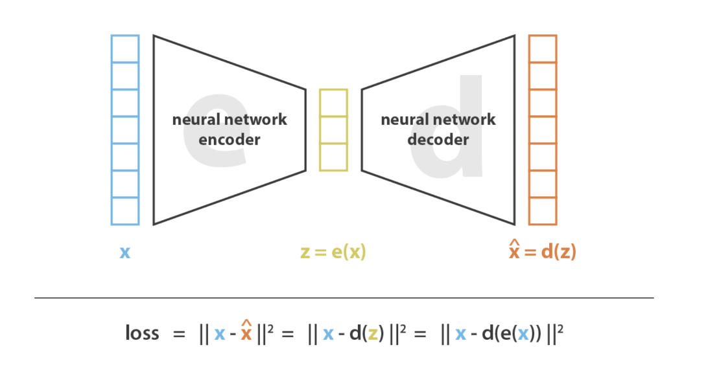

- x：显变量（observed variable），能直接被观测到的原数据，网络的输入以及期望的输出。
- z：隐变量（latent variable），被编码后的数据，特征尺寸远小于原数据，可能储存了决定这个图的少量关键信息，可通过解码器复原出x。
- x与z的关系：压缩与还原
	- 原理：假设图片可以由少量关键信息大部分。
	- encoder：**从显变量提炼隐变量**
	- decoder：**从隐变量还原显变量**

Autoencoder的训练
1. 前向传播：从训练集采样一批图片 → 编码器输出潜在表示 → 解码器输出重建图像。初始阶段参数随机，编码无意义，初始重建接近噪声。
2. 计算损失：输出的数据（最开始是噪声）与原图直接按照像素对比，计算出差距（loss）
3. 反向传播：用BP算法计算梯度，将encoder与decoder视为整体，一起更新参数
4. 迭代：训练多个epoch，直到损失下降且收敛，重建质量提升。

### VAE（**Variational Autoencoder，变分自编码器**）
 
> 初始想法：是不是可以拿掉encoder，直接从某个中间压缩的东西还原出图像？
> 难说，因为太随机其实不一定和编码后的隐藏信息等价。

> [!important] 从让编码器输出特定的向量 → 输出概率分布的参数
> 这个分布由训练集的数据计算得出

VAE与Autoencoder的关键区别：
- encoder的输出不同：Autoencoder将输入映射为一个确定性的潜在向量 z；而VAE输出潜在变量的概率分布参数（均值 $\mu$ 和方差 $\sigma^2$），随后通过重参数化技巧从该分布中采样得到 z。
- 训练目标不同：Autoencoder仅最小化重建误差（Reconstruction Loss）；VAE除了重建误差外，还引入KL散度（KL Divergence），约束潜在分布接近标准正态分布 N(0,1)。
	- VAE的KL散度：衡量 Encoder 输出的分布 q(z|x) 与标准正态分布 N(0,1) 的差异。
	  如果没有这样的约束，encoder最后得到的不同关键特征之间的均值和方差之间插值很大，随机采样很可能采到无意义的区域，解码器无法还原出有意义的东西。（让所有的样本信息被压缩到标准正态分布附近）
	  GPT：**VAE中的KL散度直接约束 Encoder 输出的高斯分布** q(z|x)**，使其均值接近0、方差接近1，从而让所有样本的潜在表示分布接近标准正态分布，获得连续且可采样的潜在空间。**
- **潜在空间性质不同**：Autoencoder学习得到的潜在空间可能是不连续的；VAE通过分布约束获得连续、平滑且具有生成能力的潜在空间，因此可以通过随机采样生成新的样本。
> [!important] 把像素空间问题搬运到潜在空间

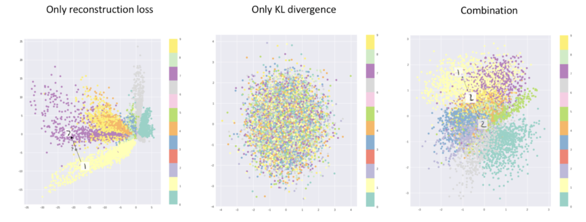

VAE核心贡献
- 确立将编码器的信息百年如到潜在空间的范式
- 让潜在空间可采样：从压缩工具变为生成模型。编码器输出分布而非固定值，加上 KL 散度约束，使潜在空间连续、平滑，任意采样都能生成合理的输出
- 重参数化技巧**Reparameterization Trick**：将不可导（无法反向传播）的”从分布中采样“的操作，转化为可反向传播的z = μ + σ·ε（ε 从标准正态采样）形式，将随机性剥离到
	- 不可导：采样得到的均值和方差，要求得分布对于这两个值的导数是难以计算的（见笔记 [[[07-变分自编码器](技术学习/13-深度学习入门-生成模型/07-变分自编码器.md#^atctdi)]]，
	- 理论基础：利用高斯分布的性质，若某个采样服从高斯分布$\varepsilon \sim N(0,1)$,那么z = μ + σ·ε也是服从高斯分布的。（这是概率论里的线性变换）
- 将神经网络与贝叶斯概率框架结合
```python
# 重采样之前的计算
z = random.normal(mu, sigma)
# 使用重采样技巧
eps = random.normal(0,1)
z = mu + sigma * eps # 随机性全部交给eps（向前传播的时候被当做常数），此时z对mu和sigma的导数可求
```
> [!note] 一句话概括重参数化
把“从 N(\mu,\sigma^2) 采样”改写成“从固定的 N(0,1) 采样后做线性变换”

Before:
```
Encoder
 ↓
随机采样
 ↓
Decoder
```

#重参数化 
```
Encoder
 ↓
μ,σ
 ↓
z = μ + σ·ε
 ↓
Decoder
```

#### 局限性与影响
局限：生成的图像模糊，因为两种损失的结合对隐空间过度正则化，缺乏高频细节

影响力
- 为后来的Stable Diffusion等模型奠定基础
- VQ-VAE
- 虽然质量不如GAN，但是思路非常超前

**VAE 参考文档**
- [ ] https://bluefisher.github.io/2020/02/07/%E7%90%86%E8%A7%A3-Variational-Autoencoders-VAEs/ （推荐）
- [ ] https://www.jeremyjordan.me/variational-autoencoders/
- [ ] https://www.ibm.com/cn-zh/think/topics/variational-autoencoder#186915249
- [ ] https://www.vectorexplore.com/tech/auto-encoder/vae.html
- [ ] https://zhouyifan.net/2022/12/19/20221016-VAE/

## 2. GAN（2014）
> [!cite] GAN — Generative Adversarial Network (2014)
_Generative Adversarial Nets_ — Goodfellow et al. (2014)https://arxiv.org/abs/1406.2661

因为生成的图像比VAE更为清晰，再2014到2020期间处于统治地位，直到2020年出现Diffusion。

核心思想
- 生成器：从随机噪声直接生成随机图像丢给判别器 —— 越逼真越好
	- 固定维度的随机噪音进行上采样，输出到和训练数据一样尺寸，用MLP（后2015年的DCGAN替换为转置CNN）实现。
- 判别器：一个分类器，接收一个图像，输出一个0~1的概率标量。判断是真实图像还是生成器生成的图像 —— 努力打假
	- 原始为MLP，后DCGAN改为CNN。
- 通过对抗的作用提升生图效果—— 纳什均衡

> [!note] 纳什均衡
> 一组策略组合，给定其他所有人策略不变，任意参与者单独更换策略，收益不会提升甚至受损，因此无人有动机单方面改变现状，局面自动稳定
>- 稳定≠最优:均衡只保证个体不愿单独改变，不代表整体收益最大；极易出现个体理性导致集体吃亏。
>- 一场博弈可存在多个纳什均衡:如情侣博弈（性别战）：一起看男方电影、一起看女方电影，两个均衡，容易协调失败。
>- 仅适用于无强制合约的非合作博弈:双方无法签订约束性协议、不能互相监督惩罚，才会陷入低效均衡；若有强制合作，可跳出纳什均衡。
>- 纳什存在定理:任何有限博弈，至少存在一个纳什均衡（纯策略或混合策略）。

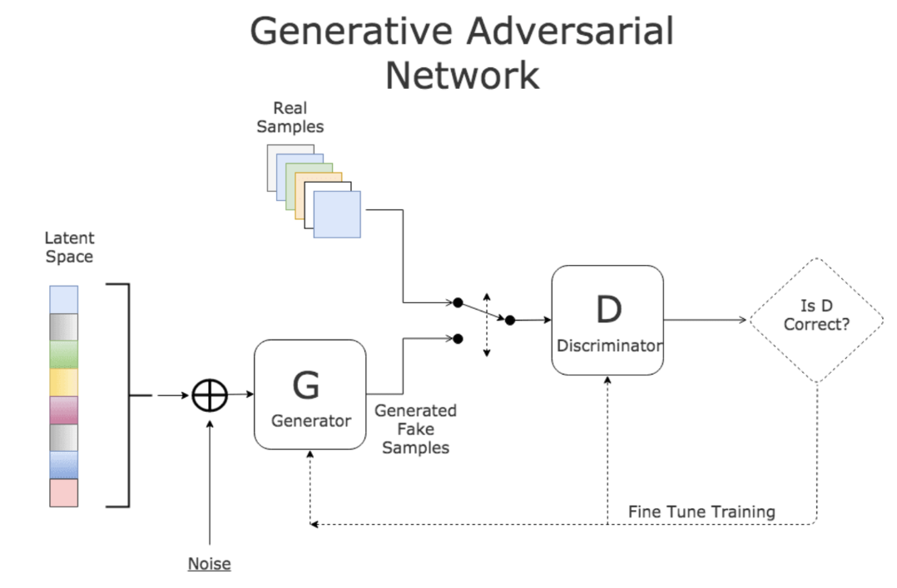

训练过程
- 损失函数：生成器G与判别器D共享一个min-max目标函数，判别器想最大化这个目标（尽量区分出真假），生成器想尽量最小化该目标（不让判别器看出来）
- 前向传播：
	- G生成得到假样本
	- D随机接收真假样本，尽量判别出区别
- 反向传播：
	- D：固定生成器，根据判别器loss对判别器进行反向传播，更新参数，使D更精准
	- G：固定判别器，梯度从D的打分一路回到G，更新G的参数，使生成的假样本更真

核心贡献
- 对抗框架：无显示定义的似然函数，无复杂的变分近似计算，利用博弈隐式学习数据分布
- 生成质量提升：相较于同期的VAE，GAN的图像更为锐利逼真，生成模型的输出达到“可用”级别
- 架构通用：该思想几乎可以用到任何网络架构和损失结合，有大量变体存在

GAN的局限
- **训练不稳定**：G和D的平衡难以维持，容易出现梯度消失、模式坍缩
	- G和D需要保持动态平衡。如果D过强，G难以获得有效梯度；如果G过强，D难以学习有效判别特征，两者容易陷入震荡或训练失败。
- **多样性不足**：模式坍缩意味着 G发现自己生成某种图总是被打假，但是另一种图很容易通过，于是只生成那种（种类较少）安全的不会被打假的图。 

然而，GAN 的训练不稳定和模式坍缩问题始终未被根本解决，这为后来扩散模型的崛起埋下了伏笔。

GAN 的对抗训练思想也被后续大量工作借用。最典型的例子是 **VQGAN**（2021）。它把 GAN 的对抗损失引入 **VQ-VAE 的 tokenizer 训练**中，大幅提升了图像离散化的质量，成为**自回归范式**的关键组件。

2021 年，Diffusion Models Beat GANs 一文的诞生标志着 GAN 在无条件/有条件图像生成上的统治地位正式被**扩散模型**终结。

**GAN 参考文档**

- [ ] https://lilianweng.github.io/posts/2017-08-20-gan/
- [ ] https://jonathan-hui.medium.com/gan-whats-generative-adversarial-networks-and-its-application-f39ed278ef09
- [ ] https://towardsai.net/p/machine-learning/diffusion-models-vs-gans-vs-vaes-comparison-of-deep-generative-models
- [ ] https://aws.amazon.com/cn/what-is/gan/
# 二、基础工作
不直接用于生成范式，但是为后续研究的扩散和自回归两种范式起到关键铺垫。

## 1. ViT（2020）
> [!quote] ViT — Vision Transformer (2020)
_An Image is Worth 16x16 Words: Transformers for Image Recognition at Scale_ — Dosovitskiy et al. (2020)https://arxiv.org/abs/2010.11929

>[!hint] 证明Transformer在视觉任务上的可用性。

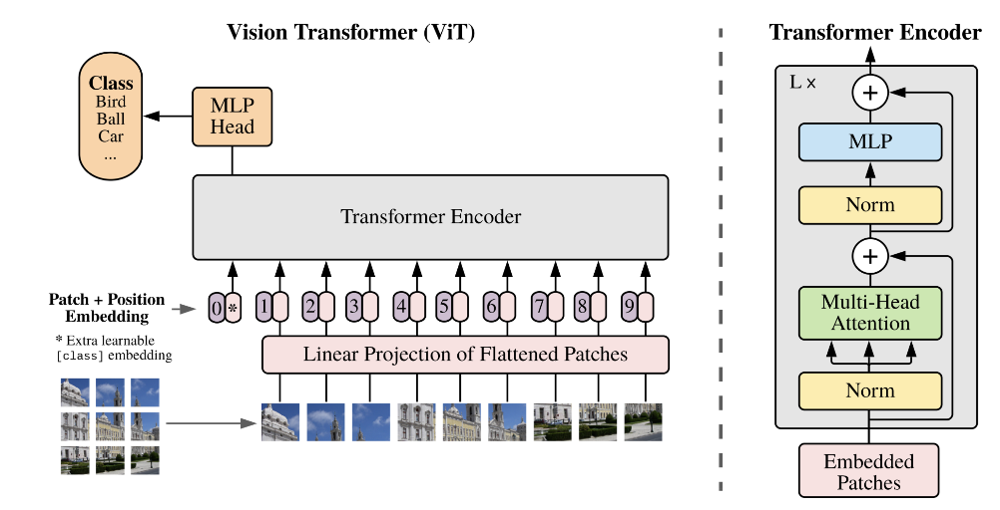
 
核心：第一次使用完全标准的Transformer（NLP领域的架构）完成视觉任务，没有使用任何卷积。是跨CV和NLP的标志性工作。

做法：将图像切分为固定大小的 patch（例如 16×16），每个 patch 线性投影成一个 token，然后用标准 Transformer 处理这些 token 序列。在<u>足够大的数据上训练后</u>，ViT **超越了所有 CNN 模型**

缺点：
- 预训练需要的数据比CNN大得多： 在中等规模数据集（如仅用 ImageNet-1k 训练）上，ViT 的表现不如同规模的 CNN，需要大规模数据或强数据增强才能发挥优势。
- 计算成本高：自注意力的二次复杂度使得处理高分辨率图像的计算成本很高

核心贡献：
- 证明纯Transformer在视觉任务的可行性：打破视觉任务必须用CNN的认知。
- **Patch Tokenization：** 将图像视为"patch 序列"的思想，为后来的 DiT（用 Transformer 替代 U-Net 做扩散）和自回归图像生成（把图像当 token 序列逐个预测）奠定了基础。
- **扩展性（Scalability）：** 展示了 Transformer 在视觉领域同样遵循**"更大模型 + 更多数据 = 更好性能"**的 Scaling Law。

> [!note-toolbar] CNN 的局限性
> CNN 的每一层只看局部区域，必须通过堆叠很多层才能间接获得全局视野。捕捉图像中远距离的关联（如图片左上角的物体与右下角的物体之间的关系）需要经过层层传递，效率较低。而 Transformer 通过注意力机制，让每个 token 在第一层就能直接与所有其他 token 建立关联，全局关系一步到位。这也是为什么在数据足够充分的条件下，ViT 能够超越所有精心设计的 CNN 模型

对后续工作的影响
- CLIP：视觉与语言的对其
- DiT：用Transformer替代Unet做扩散的骨干
- 自回归视觉生成模型：DALL-E1、 LlamaGen
- 

**CNN & VIT 参考文档**

-  https://www.datacamp.com/tutorial/vision-transformers（VIT）
- https://www.codecademy.com/article/vision-transformers-working-architecture-explained（VIT）
- https://learnopencv.com/understanding-convolutional-neural-networks-cnn/（CNN）
- https://www.codecademy.com/article/understanding-convolutional-neural-network-cnn-architecture（CNN）

## 2.CLIP
> [!quote] CLIP — Contrastive Language-Image Pre-training (2021)_Learning Transferable Visual Models From Natural Language Supervision_ — Radford et al. (OpenAI) (2021)https://arxiv.org/abs/2103.00020


> [!abstract]
> OpenAI提出的通过**对比学习**将图和文映射到同一语义空间。
> 使用了4亿个图文对（大力出奇迹），训练图像编码器和文本编码器，使两个编码器在嵌入空间中的相对一得文本更近，不匹配的对距离更远


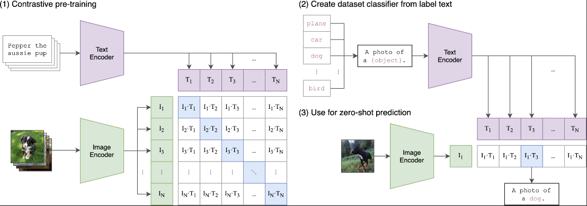

CLIP训练
- 获取数据：从互联网上得到的4亿个图-文对
- 两个编码器
	- 图像编码器：ResNet或者ViT
	- 文本编码器：Transformer
	- 每个编码器将数据压缩到固定维度（如：512维，不同版本维度不同）
- 训练目标
	- 对于一个batch中N个图文对，正确配对的图文向量在向量空间中距离更近（余弦相似度→1），另外的$N^2 - N$个不配对内容要更远（余弦相似度→0），训练结束后，两个编码器学会将语义相似的图文映射到接近的位置

CLIP的应用（文生图）
- 只使用文本编码器
- 流程：prompt → CLIP文本编码器 → 语义embedding → 扩散模型（UNet)→ 在每一步去噪过程中引导生成方向  
- CLIP本身不生成图像，而是作为一个“翻译工具”，将文本与图像的语义对齐： $\text{text embedding} \approx \text{image embedding in same space}$

影响
- 扩散范式中
	- CLIP作为Stable Diffusion的条件输入
	- DALL E2/unCLIP 则以CLIP为核心构建


**CLIP 参考文档**
- https://openai.com/index/clip/
- https://viso.ai/deep-learning/clip-machine-learning/
- https://medium.com/@ManishChablani/clip-contrastive-language-image-pretraining-summary-and-intuition-52e329a67377


---

# 三、扩散模型
> [!hint] 核心思想
> 逐步添加高斯噪声，直到该图像转换为纯噪声图像，再反向训练一个网络逐步去噪。
> 

## 1. DDPM（2020）
#DDPM

> [!quote] _Denoising Diffusion Probabilistic Models_ — Ho, Jain & Abbeel (2020)https://arxiv.org/abs/2006.11239

> [!abstract] 摘要
> 向前过程中逐步为图像添加高斯噪声，直到变为纯噪声图。；反向过程训练一个神经网络（U-Net）逐步去噪，从纯噪声恢复出数据。训练目标转化为：预测每一步添加的噪声。

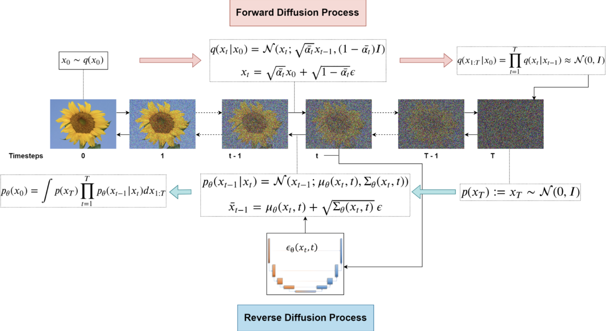

**DDPM训练过程**
- 前向加噪
	- 给定一个原图$x_0$，按照预设的噪声调度表（noise schedule）一步步叠加高斯噪声
	- 经过T步（通常T=1000）后，原图信息被噪声覆盖，变为纯噪声图像。
	- 纯数学叠加，不涉及可学习参数。关键性质： 任意时刻 t，$x_t$ 可以直接由 $x_0$ 生成，而不需要逐步递推。
	  > 高斯噪声的可合成性，多次叠加的高斯噪声仍然是高斯噪声
- 反向去噪
	- 输入加噪后的图像$x_t$，和当前时间步t，输出为对该时刻加噪的预测。
	- 训练流程是一个朴素的回归任务：：在每次迭代中，从数据集中采样真实图像 $x_0$，随机采样时间步 $t$，并通过封闭形式直接构造带噪样本 $x_t$。同时根据前向扩散公式生成对应的高斯噪声 $\epsilon$，训练网络在给定 $x_t$ 和 $t$ 的条件下预测该噪声，并通过均方误差（MSE）进行优化。
	- 时间步t也会被作为条件输入给网络，原因在于：不同 t 对应不同噪声水平，使得 $x_t$ 的统计分布显著不同。在大 t 时，**样本接近纯高斯噪声**，模型需要**恢复全局**结构；在小 t 时，**样本仅含少量噪声**，模型主要进行**高频细节修复**。因此去噪函数本质上是一个依赖噪声强度的条件函数 $\epsilon_\theta(x_t, t)$，而非统一映射。
	  - 人话：t 表示当前噪声强度，输入给模型是为了让它知道图像“被破坏到什么程度”，从而在不同噪声水平下学习不同的去噪方式：大噪声时恢复结构，小噪声时补细节
	- 损失函数：MSE均方误差，计算真实噪声与预测噪声之间的差距

**DDPM生成图像**
- 随机采样一张纯高斯噪声图作为 x_T，从 t=T 开始，每一步让去噪网络预测当前噪声并将其减去，同时注入一点更小的随机噪声（维持采样的随机性），得到 $x_{t-1}$

**主流去噪网络框架**
- U-Net
	- 原文架构
	- 编码器逐层提取抽象特征
	- 解码器放大还原分辨率
	- skip connection传递信息，使输出同事保留深层语义和浅层细节
	- 输入输出尺寸相同，适用于去噪任务
- Transformer（DiT)
	- 噪声图像切分为patch，注意力机制让每个patch可以从第一层就与其他patch直接交互，全局信息捕捉效率更高，扩展性强。（Sora已采用[Link](https://arxiv.org/abs/2212.09748）)

**局限性**
- **采样速度慢**：反向去噪需要上千步迭代（如 T=1000），每一步都需要一次完整的网络前向传播，生成一张图像需要数分钟，远慢于 GAN 的单次前向传播。
- **分辨率受限**：在**像素空间**直接做扩散的计算成本随分辨率平方增长，DDPM 的实验仅限于 32×32 和 256×256。
- **无条件生成：** 原始 DDPM 仅做**无条件生成**，不支持文本、类别等条件引导。
**DDPM 参考文档**
- https://lilianweng.github.io/posts/2021-07-11-diffusion-models/  （非常严谨清晰，推荐）
- https://learnopencv.com/denoising-diffusion-probabilistic-models/
- https://theaisummer.com/diffusion-models/
- https://zhouyifan.net/2023/07/07/20230330-diffusion-model/（中文）
- https://calvinyluo.com/2022/08/26/diffusion-tutorial.html

## 2. Diffusion Models Beats GANs（2021）
> [!quote] _Diffusion Models Beat GANs on Image Synthesis_ — Dhariwal & Nichol (OpenAI) (2021)https://arxiv.org/abs/2105.05233

> [!hint] 使用**分类器**实现**条件化生成图像**；扩散模型正式超越GAN
-  扩散模型一直以来在生成质量指标上无法超越最好的GAN，而这个论文首次让扩散模型在ImageNet条件生成上超越了GAN

> [!note]
> - **提出时面临的问题**：在 2021 年之前，生成对抗网络（GANs）在图像合成质量（如 FID 目标指标）上占据着绝对统治地位，而早期的扩散模型（如 DDPM）虽然展示了优秀的分布覆盖能力和训练稳定性，但在高分辨率、复杂数据集（如 ImageNet）上的**生成图像质量（保真度）仍逊于 GAN**，且采样速度极慢，也缺乏一种类似 GAN “截断技巧（Truncation Trick）”的在多样性与保真度之间自由权衡的机制。
>- **改进方法**：本文通过大量的消融实验（Ablation Studies）**彻底优化了扩散模型的 UNet 骨干架构，并首次引入了**分类器引导（Classifier Guidance）技术。通过在反向去噪过程中加入一个预训练图像分类器的梯度，来引导模型向指定类别生成。
>- **对生成图像领域的意义**：**这是扩散模型首次在图像生成质量（FID）上全面超越当时最强的 GAN（如 BigGAN-deep）**。它打破了 GAN 在生图领域的垄断，正式开启了扩散模型（Diffusion Models）作为下一代生成式 AI 核心基座的时代。


```Plain
具体来说，每一步去噪时：
1. 扩散模型先正常预测去噪方向
2. 把当前的中间结果丢给分类器，问它"这像不像目标类别（比如'金毛犬'）？"
3. 分类器算出一个梯度，指示"往哪个方向改一改就更像金毛犬"
4. 把这个梯度叠加到去噪方向上（最终方向 = 原始去噪方向 + 分类器梯度）

注意这里的关键：扩散模型本身完全不认识文字，也没有任何文本输入。它就是个无条件去噪器。所有的"引导"都来自外部的分类器梯度硬拽。
```

>[!sucess] **核心贡献**
- **架构大步升级**：探明了更深/更宽的网络、多头注意力机制、全分辨率注意力层、BigGAN 残差块以及自适应组归一化（AdaGN）对扩散模型效果的显著加成。 
- **分类器引导机制（Classifier Guidance）**：提出利用分类器梯度控制生图走向的方法，不仅适用于随机采样，也成功适配了确定性采样（DDIM）。
- **实现保真度与多样性的完美权衡（Trade-off）**：引入了“梯度缩放因子 $s$”。增大 $s$ 可以让图像更贴合类别特征（提高 Precision 和 IS 评分），减小 $s$ 则保留更多样式的分布（提高 Recall）。
- **大幅压缩采样步数**：配合引导机制，模型在使用 DDIM 仅进行 25 次前向传播（25步）时，图像质量即可媲美需要数百步的传统模型。

>[!attention] **局限性**
- **采样速度依然较慢**：尽管将步数压缩到了 25 步，但与 GAN 这种“一步到位（One-shot forward pass）”的生成网络相比，扩散模型仍需要循环进行多次前向计算，推断成本高。
- **对外部标签/分类器的强依赖**：该技术极度依赖带有显式标签的数据集。对于无标签的数据集，分类器引导则无法直接发挥作用。
- **分类器对抗样本风险**：如果梯度缩放因子 $s$ 调得过大，图像可能会过度迎合分类器的特征识别偏好（甚至走向对抗攻击特征），导致画面失真或过于单一。

> [!note] 对后续工作的影响
- **推动了无分类器引导（Classifier-Free Guidance, CFG）的诞生**：正因为本文指出了“引导机制”对提升生图质量的决定性作用，随后业内（Ho & Salimans）在此基础上进化出了不需要独立分类器的 CFG 技术。如今无论是 **Stable Diffusion**、**Midjourney** 还是 **Flux**，其中控制提示词相关性的关键滑块（Prompt Weight / CFG Scale）全部源自于本文的核心思想。
- **直接孵化了 OpenAI 的里程碑模型**：OpenAI 随后将这一套“改进版 UNet 架构 + 引导思想”直接复用并扩展到了多模态领域，成功打造了震动业界的 **DALL-E 2**。  
- **加速了超分辨率级联架构（Upsampling Stacks）的普及**：文中证明了“低分辨率引导生图 + 高分辨率扩散上采样”的互补性，这一级联思路被后来的 Google Imagen 等多款顶级商业大模型广泛采纳。

## 3. GLIDE(2021)

> [!quote] GLIDE - **G**uided **L**anguage to **I**mage **D**iffusion for Generation and **E**diting
_GLIDE: Towards Photorealistic Image Generation and Editing with Text-Guided Diffusion Models_ — Nichol et al. (OpenAI) 
(2021)https://arxiv.org/abs/2112.10741
> [code](https://github.com/openai/glide-text2im)
> 

> [!important] 实现无需分类器的自然语言生图

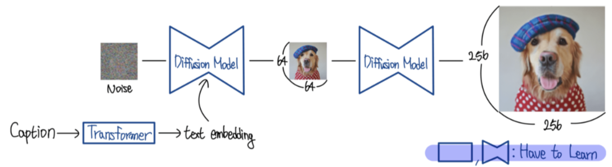

**【模型简介】**
- **面临的问题：** 在 GLIDE 提出前，主流的文本生成图像（Text-to-Image）模型（如早期的 [DALL-E](https://arxiv.org/abs/2102.05918)）虽然具有较强的零样本概念组合能力，但其**生成的图像在逼真度（Photorealism）上仍有欠缺**，细节模糊。另一方面，无条件或类条件扩散模型（Diffusion Models）虽然能生成极高质量的逼真图像，但**缺乏灵活、自由的文本控制能力**，无法应对复杂的提示词。
- **改进方法：** GLIDE 将引导扩散模型（Guided Diffusion）应用到了文本条件图像合成任务中。论文**系统性地对比了两种文本引导策略**：基于带噪声的 CLIP 引导（CLIP Guidance）和**无分类器引导（Classifier-Free Guidance, CFG）**。最终发现无分类器引导能够更好地兼顾画质与文本一致性，并基于此训练了一个拥有 35 亿参数的文本条件扩散模型，并进一步微调使其支持功能强大的图像局部修复（Inpainting）与编辑。
- **对生成图像领域的意义：** GLIDE 证明了**扩散模型（Diffusion Models）在文本生成图像任务上的表现全面超越了当时主流的自回归（Autoregressive）模型**。它以更小的参数量（3.5B vs DALL-E 的 12B）和更低的采样延迟，刷新了画质和文本匹配度的标杆，彻底拉开了扩散模型统治文本生图领域的序幕。


**【模型结构】**
- **基础基础模型（Base Model）：** 采用 ADM（Ablated Diffusion Model）的 UNet 架构，分辨率为 **64×64**。视觉部分通道数扩展至 512，约 23 亿参数。
- **文本编码器（Text Encoder）：** 24 块、宽度为 2048 的 Transformer，约 12 亿参数。Transformer 的最终 Token 嵌入替代类嵌入，且**最后一层的序列嵌入通过交叉注意力（Cross-Attention）** 机制融合进 UNet 的每一层。
- **超分辨率模型（Upsampling Model）：** 15 亿参数的扩散模型，用于将图像分辨率从 **64×64** 提升至 **256×256**。


【训练阶段流程】
1. 输入数据：从大规模互联网数据集中获取 (图像 $x_0$, 文本描述 $c$) 对。
2. 文本编码：通过 Transformer 将文本 $c$ 编码为 Token 特征序列。
3. 扩散前向过程：按照预设的噪声衰减系数，向图像 $x_0$ 逐步加入高斯噪声，生成各个时间步 t 的含噪图像 $x_t$。
4. 模型预测：将 $x_t$、时间步 t 以及文本序列特征输入到 UNet 中，训练模型预测所加入的噪声 $ε$。
5. 引入无分类器引导机制（微调）：在训练过程中，以 20% 的固定概率将文本 $c$ 替换为空白序列 $∅$，使模型同时兼备条件生成和无条件生成能力。
6. 引入图像修复能力（微调）：随机擦除图像的局部区域，向 UNet 额外提供 4 个输入通道（3通道的未掩码区域图像 + 1通道的 Mask 掩码），训练模型补充缺失区域。
>[!hint] 训练要点
>- 任务核心：预测该步所加噪声，损失函数仍为预测噪声与真实噪声之间的MSE
> - 【5】核心：网络同时学会有文本的去噪和无文本的去噪。不依赖外部分类器，网络自身可以提供“有条件/无条件”两种预测之差
> - 【Cross-attention】：文本通过交叉注意力参与U-Net的每一层计算，使文本在整个去噪过程发挥作用

**【生成阶段流程 (推理采样)】**
1. 初始化：从高斯分布中随机抽取纯噪声图像 $x_T \sim N(0, I)$，并指定目标文本 c。
2. 循环去噪 (从 $t = T$ 逐步倒推至 $t = 1$)：
    a. 分别计算在目标文本条件下的模型预测噪声：$ε_θ(x_t | c)$
    b. 计算在无文本（空序列）条件下的模型预测噪声：$ε_θ(x_t | ∅)$
    c. 结合无分类器引导公式进行外推，计算最终的引导噪声：
       $引导噪声 = ε_θ(x_t | ∅) + s * (ε_θ(x_t | c) - ε_θ(x_t | ∅))$  (其中 s 为引导权重 scale)
       > 即 **「无条件方向 + 引导强度 ×（有条件方向 − 无条件方向）」**
       > 引导强度越大，生成越贴合文本，但过大会牺牲多样性和真实感

    d. 利用引导噪声更新图像，得到稍清晰的图像 $x_{t-1}$。
3. 得到基础画作：循环结束后，获得 64x64 分辨率的初版图像。
4. 超分辨率重建：将 64x64 图像作为基底，通过 1.5B 强度的超分辨率扩散模型，最终放大输出 256x256 的高清晰度逼真图像。

【局限性】
- **文本理解能力有限：** 当面对一些过于反常或复杂的提示词时（例如：“一只长着八条腿的猫” 或 “用履带代替轮子的自行车”），模型往往无法正确渲染出语义。
- **采样速度慢：** 作为标准的扩散模型，生成一张图像需要经历多次逆向迭代计算，在当时的硬件下完成一次生成需要多秒（如 A100 上约 15 秒），相较于 GAN 或单次前向的自回归模型，实时推理成本较高。
- **仍存在像素空间操作**：GLIDE直接在64×64像素空间做扩散，后续上采样到256x256
- **社会偏见与安全隐患：** 模型仍会保留并可能放大训练数据集中的西方刻板印象及性别偏见（如“女孩的玩具”会产生更多的粉色）；同时其强大的编辑修复功能存在被滥用制作为伪造 disinformation 的风险。

【参考文档】
[一个韩语的GLIDE讲解博客](https://ffighting.net/deep-learning-paper-review/diffusion-model/glide/)

---
## 4. LDM（2021）/ Stable Diffusion

>[!quote] _High-Resolution Image Synthesis with Latent Diffusion Models_ — Rombach et al. (2021)https://arxiv.org/abs/2112.10752

>[!important] 引入VAE，在隐空间解决扩散架构算力问题

**【简介】**
 LDM是Stable Diffusion的理论基础。
 从上述的学习中，生成范式已经有了：扩散模型骨架、条件化生图、自然语言生图。
 
 仍存在的问题：以往的扩散模型训练和推理需要**高频、连续地在极高维度的RGB空间**内进行复杂的梯度计算与函数评估，造成了巨大的资源消耗； 最大似然目标函数容易使模型将**大量容量花费在拟合人类难以察觉的高频像素细节**上，而非专注学习宏观的语义与概念构成。
 
 LDM的解决方案：将完整扩散去噪过程从原始像素空间迁移至低维潜空间执行。以预训练 VAE 实现图像压缩与重建：先通过 VAE 编码器把高分辨率原图映射为低分辨率潜向量；仅在该潜空间训练扩散模型完成加噪 / 去噪；推理阶段对去噪后的潜特征输入 VAE 解码器，还原输出高分辨率图像。
> 该架构后备用于Stability AI用于训练并开源Stable Diffusion

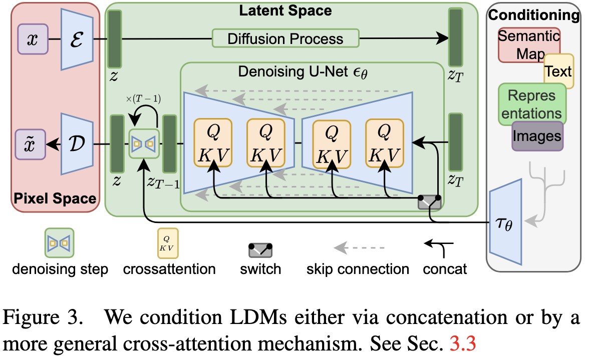

```Plain
左边的红色区域是 Pixel Space（像素空间）。
原始图像 x 在这里进出。上方的编码器 E 把图像压缩成 latent z，下方的解码器 D 把 latent 还原回图像 x̃。这一对 E/D 就是一个预训练好的 autoencoder（论文里用的是带感知损失的 VQ-VAE 变体），训练完就冻住不动了。它的作用只有一个：让后面所有的扩散运算都在小得多的 latent 上进行，而不是在高分辨率像素上硬算。

中间的绿色区域是 Latent Space（潜空间）。
这是整个模型真正干活的地方。上方那条从左到右的箭头标着 "Diffusion Process"，就是前向加噪：干净的 latent z 被逐步加噪变成纯噪声 z_T。下方那个蓝色的蝴蝶结形状就是 Denoising U-Net ε_θ，负责反向去噪：从 z_T 一步步预测噪声、还原出 z。上面标的 ×(T−1) 表示这个去噪过程要迭代 T 步。

右边的灰色区域是 Conditioning（条件输入）。
这里画了好几种可能的条件来源：语义图（Semantic Map）、文本（Text）、图像（Images）等等。不管输入是什么模态，都先通过一个领域专用的编码器 τ_θ 编码成统一的中间表示（Representations），然后送进 U-Net。
```


**【模型结构】**
 - **VAE（encoder+decoder)**：负责像素空间与潜在空间之间转换。Encoder：将高分辨率图像压缩为低维表示；Decoder：将隐表示还原为高分辨图像。VAE在扩散训练之前单独训练完成，扩散阶段参数不变。
 - **去噪U-Net**：作为扩散模型的骨干，输入的不是像素图像，而是来自VAE压缩后的隐表示，结构与DDPM的U-Net一致，输入和输出的尺寸相同，任务：预测噪声。
 - **条件机制（cross-attention)**：继承GLIDE思路，由文本编码器为模型嵌入信息，通过交叉注意力注入U-Net各层，引导生成方向。除文本外的：图像不拘、语义图等条件可以用类似方式接入。
 > 原始LDM采用BERT风格文本编码器，后Stable Diffusion v1 采用CLIP ViT-L/14作为文本编码器。

**【训练过程】**
- 第一阶段：训练VAE，使编码器学会将图像压缩为紧凑表示、解码器可以高质量还原 —— 获得“感知压缩”良好的隐空间。训练好后冻结VAE参数。
- 第二阶段：在音空间中训练扩散模型：图片输入VAE编码器获得压缩的隐表示$z_0$，对$z_0$执行DDPM一样扩散流程：按照时间步t为$z_0$加噪得到$z_t$，让Unet预测所加早上，与真实噪声做MSE得到损失，反向传播优化模型。文本经由cross-attentioin参与每一步预测。
>[!hint] 关键：扩散的加噪去噪和迭代都发生在低维空间，处理的数据量比像素空间小2个数量级，训练成本大幅下降。

【局限性】
- VAE重建瓶颈：图像质量上限受到VAE解码器限制，会丢失部分高频细节，在精细纹理不如像素级扩散模型
- 两阶段训练：要先预训练VAE，再训练扩散模型
- 小物体和文字生成弱

【**地位 & 影响**】

这篇论文就是 **Stable Diffusion** 的学术基础。它的开源让整个社区爆发，直接催生了 **Midjourney** 等生态。可以说是整个扩散生成领域影响力最大的一篇文章。

【**Stable Diffusion 参考文档**】

- https://jalammar.github.io/illustrated-stable-diffusion/
- https://www.louisbouchard.ai/latent-diffusion-models/

## 5. DALL·E2（2022）
>[!quote] _Hierarchical Text-Conditional Image Generation with CLIP Latents_ — Ramesh et al. (OpenAI) (2022) https://arxiv.org/abs/2204.06125

> [!hint] 使用反转CLIP的创意生图，提升扩散模型的图文对齐质量。

思考：CLIP中图文match的点在空间距离更为接近，是否能从文本出发找到图像对应的点？

【简介】
对比E1，技术路线从自回归转向扩散模型。

在 unCLIP 提出之前，传统的文本条件扩散模型（如 GLIDE）在生成图像时，主要依赖 **分类器自由引导（Classifier-Free Guidance, CFG）** 技术来提高图像与文本的契合度（保真度）。然而，这种做法会导致**生成样本的多样性严重坍塌**——即加大引导权重后，模型生成的画幅、角度、颜色等往往趋同。此外，如何高效利用多模态对比学习（如 CLIP）的联合潜在空间来实现更高级的图像编辑和插值，也是当时亟待解决的课题。

DALL·E2核心是“反转CLIP”：先用CLIP把文本映射为文本嵌入，再训练一个“Prior”模型（扩散模型或自回归模型）将文本嵌入映射为CLIP图像嵌入，最后用扩散解码器从CLIP图像嵌入生成图像。

整个生成过程在CLIP联合语义空间进行，继承了CLIP的图文对齐能力。

**改进方法：** 论文提出了一个两阶段的层级生成框架 **unCLIP**（因为它通过逆转 CLIP 图像编码器的映射来生成图像）：
1. **Prior（先验网络）：** 接收文本描述，负责预测或生成对应的 **CLIP 图像嵌入（Image Embedding）**。
2. **Decoder（解码器网络）：** 接收该图像嵌入（并可选地结合文本），通过扩散模型反向恢复出高分辨率的实际图像。

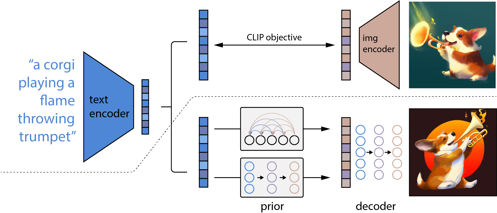


```Plain
虚线以上：CLIP 预训练
文本 "a corgi playing a flame throwing trumpet" 经 text encoder 变成一个文本向量。
对应的图片经 img encoder 变成一个图像向量。
CLIP objective（双向箭头）拉近配对的两者、推远不配对的。
训练完，这两个编码器就冻住不动了，后面全程不再变。
--------------------------
虚线以下：DALL·E 2 生图过程
- 第一步 prior（先验）：拿冻住的 text encoder 输出的文本向量，把它"翻译"成一个 CLIP 图像向量。图里画了两种实现方式：上面带弧线箭头的是自回归（autoregressive）prior，下面是扩散（diffusion）prior，论文最后选了扩散版。
- 第二步 decoder（解码器）：拿 prior 产出的图像向量作为条件，用一个扩散模型生成最终图片。
--------------------------
注意右上和右下是两张不同的柯基图：右上是训练时用的真实配对图，右下是模型实际生成的结果。
```

【模型结构】
- **CLIP**：预训练好的可以将文本和图像对齐到同一特征空间的对比学习模型，有图像编码器和文本编码器。
- **Prior**：负责"文本语义 → 视觉语义"的映射，将CLIP的文本编码器的输出转化为CLIP的图像嵌入，骨干为Transformer。
- **Decoder**：负责"视觉语义 → 像素"的生成,是一个以 CLIP 图像嵌入为条件的**扩散模型(U-Net 骨干,改编自 GLIDE)**,将图像嵌入还原为图像,再经额外的上采样扩散模型提升至高分辨率。
- **Upsampler**（上采样模型） :  Decoder 先生成较低分辨率的图像(64×64),再经一至两级上采样扩散模型逐步提升至 1024×1024(64→256→1024)。是**扩散模型(U-Net 骨干)**,但不是从噪音回复图像，而是从低分辨图扩散去噪，生成放大后的高频细节。只提升清晰度，不改变图像语义内容。

**【训练过程】**
1. **CLIP的准备**：用预训练好的CLIP模型，文本编码器和图像编码器的对两种数据的嵌入能够很好的对齐。
2. **训练Prior**（从文嵌入到图嵌入）：输入CLIP的文本编码器得到的文本嵌入，预测CLIP会对应的图嵌入，以真实图像的图嵌入作为监督目标。目的：学会在CLIP的对齐空间内找到文字嵌入对应的图片嵌入。
3. 训练Decoder（图嵌入还原到图像）：训练标准扩散模型，取真土，用CLIP图像编码器得到图嵌入，按照DDPM方式对真图加噪，扩散模型在该嵌入的条件下预测所加入的早上，以MSE反向传播。目的：给定一个CLIP图嵌入，能还原出语义匹配的图像

**【生成过程】**
路径：文本 → 文本嵌入 → 图像嵌入 → 图像
1. 文本编码：输入prompt，经过冻结的CLIP的文本编码器得到文本嵌入
2. Prior因三个号：Prior接受第一步的文本嵌入，得到对应的CLIP图像嵌入
3. Decoder解码(是一个生成模型)：扩散解码器以该图像嵌入为条件，从纯噪声开始逐步去噪，生成一张较低分辨率的图像。
4. 上采样：再经上采样扩散模型提升至 1024×1024，得到最终结果

>[!note] DALL·E 2 的 Decoder 并不关心输入来自文本还是图片，它只负责把 **CLIP 图像嵌入（语义表示）** 转换成图像。因此，真实图片可以先通过 CLIP Image Encoder 得到语义表示，再交给 Decoder 生成一张**语义一致但视觉细节不同**的新图片；同样，只要对这个语义表示进行适当修改，就能自然实现图像编辑。

**【对生成领域的意义】**： unCLIP 成功将语义理解（CLIP）**与**感知细节生成（Diffusion）进行了解耦。它不仅在图像保真度与多样性之间取得了极佳的折中，而且证明了利用多模态潜在粒子（Latents）作为中间桥梁，能够赋予生成模型强大的零样本（Zero-shot）图像变体生成、图像插值和语言驱动编辑能力。

【局限性】
- 属性绑定问题： 继承了 CLIP 的弱点——在涉及多个对象和属性的组合场景中，容易出现属性混淆（如"红色的立方体和蓝色的球"可能生成颜色错误的搭配）。
- 文字生成能力弱： 模型难以在生成的图像中正确渲染文字。
- 多阶段复杂性： 需要分别训练 CLIP、Prior、Decoder 和上采样模型，整体流程较为复杂。
- 闭源： DALL·E 2 未开源，限制了学术复现

## 6. DiT(2022）
#DiT
>[!quote] DiT — Diffusion Transformer (2022) _Scalable Diffusion Models with Transformers_ — Peebles & Xie (2022)https://arxiv.org/abs/2212.09748

>[!hint] **将扩散模型的骨干网络从 U-Net 换成 Transformer。**

【简介】
 DiT 彻底**放弃了传统的 U-Net 架构**，转而采用标准的 **Vision Transformer (ViT)** 架构。它在隐空间（Latent Space）中运行，将图像切分为 Patch（图像块）并转换为 Token 序列，并通过引入创新的自适应层归一化（adaLN-Zero）等机制来注入时间步（Timestep）和类别标签（Class Label）等条件信息。

【模型结构】
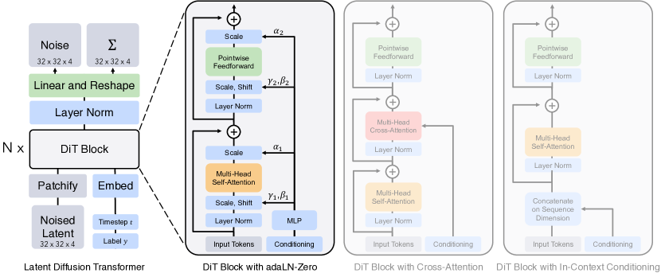

结合ViT、LDM的思想，作用在LDM的潜空间：
- **潜空间输入（来自 LDM）**： DiT 不在像素空间操作，而是先用一个**预训练 VAE** 把图像压缩为低维隐表示，扩散在这个**隐空间**中进行，以降低计算成本。
- **Patch 化与 token 序列（来自 ViT）**： 将带噪声的隐表示切分为固定大小的 patch，每个 patch 线性投影为一个 token，从而把二维隐表示转化为一维 token 序列。
- **标准 Transformer 骨干**： 用一连串标准 Transformer 块处理该 token 序列，借注意力机制让每个 patch 从第一层起就能与所有其他 patch 直接交互，全局信息捕捉效率高于逐层扩大感受野的 U-Net。
- **条件注入（adaLN-Zero）**： 时间步 t 与类别等条件信息通过自适应层归一化（adaptive layer norm，adaLN-Zero）注入每个 Transformer 块，引导去噪过程。
	- DiT 论文本身**不是文生图**，它做的是 ImageNet 上的**类别条件生成**，即：给一个类别编号（比如 281 号=橘猫），生成对应类别的图片。所以条件是 label 而不是自然语言。这篇论文的目的不是做一个产品级的文生图模型，而是**验证一件事**：把扩散模型的骨架从 U-Net 换成 Transformer 效果会怎样

>[!note] DiT 的核心流程包括：1. VAE 编码 $\rightarrow$ 2. 图像切块（Patchify）与位置编码 $\rightarrow$ 3. Transformer 块堆叠（含 adaLN-Zero 条件注入） $\rightarrow$ 4. 线性解码与还原。

**【训练过程】**：感觉更接近于LDM的模式，只是将隐空间的扩散骨干替换为Transformer
- **隐表示加噪**： 取一张真图，先用冻结的 VAE 编码器压缩为隐表示 z₀，随机采样时间步 t，按扩散调度向 z₀ 加噪得到 zₜ。
- **patch 化与预测**： 将 zₜ 切成 patch token 序列，连同经 adaLN-Zero 注入的时间步与类别条件一起送入 Transformer，让其预测所加的噪声。
- **损失与更新**： 预测噪声与真实噪声做 MSE，反向传播更新 Transformer 参数（VAE 保持冻结）。整个流程与 DDPM 的回归式训练完全同构，仅把 U-Net 替换为 Tran

**【生成过程】**
生成沿用扩散模型的标准迭代采样，在潜空间完成后再解码。
- **隐空间采样**： 在潜空间随机采样一个纯噪声隐表示，切成 patch 序列，从 t=T 开始让 Transformer 在条件引导下逐步预测并去除噪声，反复迭代至得到干净的隐表示 z₀。
- **解码还原**： 将 z₀ 送入 VAE 解码器还原为最终图像。

**【核心贡献】**
- **架构创新**：首次成功将纯 Transformer 架构（DiT）应用为潜变量扩散模型（LDM）的主干网络。 
- **发现 Scale 规律**：深入分析了网络复杂度（Gflops）与样本质量（FID）的关系，证实提高 Transformer 的深度/宽度或增加输入 Token 数量（减小 Patch Size）能持续且高效地提升图像生成质量。 
- **adaLN-Zero 模块**：设计了 adaLN-Zero（Adaptive Layer Norm with Zero initialization）条件注入机制，不仅计算极其高效，而且通过将残差块初始化为恒等映射，极大提升了模型训练的稳定性和最终性能。
- **SOTA 性能**：最大的 DiT-XL/2 模型在 ImageNet $256 \times 256$ 基准上取得了当时最先进的 **2.27 FID**，且相比传统像素级 U-Net（如 ADM）计算效率大幅提升

【局限性】
**计算资源消耗巨大**：虽然其计算效率高于某些像素级 U-Net，但当 Patch Size 减小（如从 4 变 2）或处理高分辨率图像时，Token 序列长度 $T$ 成倍增加。由于 Transformer 自注意力机制的复杂度与序列长度呈 **二次方关系（$O(T^2)$）**，显存和算力开销在长序列下会急剧飙升。

# 四、自回归范式
**核心思想**：将图像拆成序列，然后像语言模型生成文字一样逐渐预测下一个token。起步于2016年，在扩散模型的影响下沉寂多年后，2024年再次成为焦点。

> [!info] 自回归（Autoregressive，AR)
> - 字面意思： **Auto（自己） + Regressive（依赖过去）**
> - 概括：每一步的生成都依赖于之前已经生成的结果。 
> - 语言模型中：根据前面的词语预测下一个词。
> > "今天天气" → 预测 → "真"
> > "今天天气真" → 预测 → "好"
> > ……
> 
> - 图像模型中：**生成的是像素（或 token）**
> - 核心：序列化、逐步推进、前面决定后面
> - 与扩散模型的区别：扩散模型直接处理整个图像，而不是一个位置一个位置地填充

发展流程，编号对应后续算法介绍
1. 引入自回归骨干网络，还未引入tokenizer
2. 引入tokenizer
3. 使用两种不同细粒度的 tokenizer
4. 用GAN的思想进一步优化了tokenizer的质量，骨干生成网络换成Transformer
5. 

## 1. Pi限额了RNN/PixelCNN(2-16)

>[!quote] _Pixel Recurrent Neural Networks_ — van den Oord et al. (DeepMind) (2016)https://arxiv.org/abs/1601.06759

>[!hint] **自回归生图的开山之作：像生成文字一样按顺序预测生成像素。**

当时还没有Transformer来解决长距离问题……

【简介】
自回归图像生成的开山之作。
整个范式的核心理念「图像可以被当作序列来自回归生成」**即由此确立。
论文提出将图像生成看作一个**序列预测问题——像语言模型一个字一个字写文章一样，让模型**沿二维空间轴逐个像素（Pixel-by-pixel）地预测图像**。

为了高效处理二维空间依赖，论文发明了两种新颖的二维 LSTM 结构：**Row LSTM** 和 **Diagonal BiLSTM**，并首次在深层循环网络中引入了**残差连接（Residual Connections）**。此外，模型将像素值视为 **0-255 的离散变量**，直接用 Softmax 输出概率分布，而不是像以前那样用连续分布去逼近。

【模型结构】
两类方法来实现从已知像素预测下一像素：
- 二维循环层的创新（Row LSTM & Diagonal BiLSTM）： 用循环神经网络（**LSTM**）建模像素间的长程依赖。沿序列逐步推进，理论上能记住此前所有像素的信息，建模能力强，但因循环结构难以并行，速度慢。
	- 方法
		- **Row LSTM：** 采用 $k \times 1$ 的一维卷积沿行处理，能够捕捉当前像素上方的一个近似三角形的上下文区域。
		- **Diagonal BiLSTM：** 通过“错位（Skewing）”操作将图像沿对角线平行化，使用 $2 \times 1$ 的极小卷积核，首次实现了**无盲角的全局上下文捕捉**。
- **提出 PixelCNN 作为并行加速方案：** 作为 PixelRNN 的简化伴生结构，论文提出了完全基于卷积的 **PixelCNN**。虽然由于感受野受限导致生成质量略逊于 Diagonal BiLSTM，但在训练时它可以**全图并行计算**，速度大幅提升
- 技巧
	- **引入 Masked Convolution（掩码卷积）：** 设计了 Mask A 和 Mask B 两种掩码机制。不仅确保了模型在预测当前像素时绝不会“偷看”未来的像素，还精妙地处理了同一个像素内部 **R $\rightarrow$ G $\rightarrow$ B 通道之间**的先后依赖关系
	- **像素离散化建模：** 摒弃了传统的连续高斯分布假设，将每个像素通道建模为 256 维的离散多项分布（Softmax）。这使得模型可以轻松学习到任意多峰（Multimodal）、长尾或不对称的复杂概率分布。
- 输出形式： 两者最终对每个像素输出一个在像素取值上的概率分布（将像素值当作离散类别预测），从该分布中采样得到具体像素值。
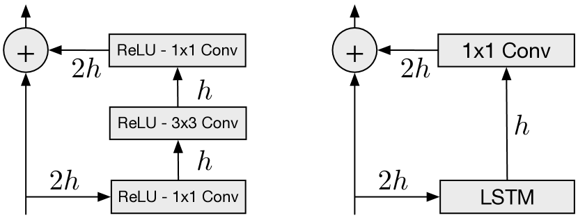

【训练过程】
得益于因果约束的设计，**PixelCNN** 训练阶段**无需真正逐像素串行**（PixelRNN 还是得串行）。PixelCNN 的训练：
- 监督信号： 训练用的真图本身就提供了每个像素的"标准答案"，任务是让网络在"只看前面像素"的条件下，预测出当前像素的正确取值。
- 并行训练： 由于真图的全部像素已知，掩码结构保证了每个位置只依赖其前序像素，因此整张图所有位置的预测可以一次性并行计算，再统一与真值比对、反向传播。损失为对每个像素分类的负对数似然。
- 关键点： 训练能并行，是因为"前面的像素"在训练时已由真图给定；这一点与生成阶段必须串行形成鲜明对比。
【生成过程】
生成阶段无法并行，必须严格逐像素串行。
- 逐像素采样： 从图像左上角第一个像素开始，网络依据已生成的像素预测当前像素的概率分布并采样，得到一个具体像素值；将其填入图中，作为下一步的"上文"，再预测下一个像素。
- 串行推进： 按光栅扫描顺序一个接一个地生成，前一个像素未确定，后一个就无法开始，直到填满整张图。这正是该范式生成极慢的根源。

【局限性】
- **极其缓慢的生成速度（推理瓶颈）：** 由于自回归模型的天然特性，图像生成必须**逐个像素串行**进行。生成一张 $32 \times 32$ 的小图需要网络前向传播 $32 \times 32 \times 3 = 3072$ 次。这种 $O(N^2)$ 的时间复杂度导致它完全无法直接应用于高分辨率图像（如 1024x1024）的实时商业生成。
- **感受野与计算开销的权衡：** 表现最好的 Diagonal BiLSTM 虽然能看到全局，但需要复杂的错位（Skewing）和取消错位操作，难以在现代硬件上发挥最大算力；而并行的 PixelCNN 虽然训练快，但感受野是有限的包围圈，容易丢失更宏观的全局结构。

【地位与影响】
它确立了生成式 AI 领域的自回归（Autoregressive）路线。虽然如今在大尺度的文生图领域，扩散模型（Diffusion Models，如 Stable Diffusion）成为了绝对的主流，但**自回归图像生成**（如 2024-2026 年再度流行的大语言模型统一视觉方案 Llama 3-Vision, Show-o 等）依然将 PixelRNN 视为鼻祖。

【参考】
卷积神经网络：
-  https://medium.com/thedeephub/convolutional-neural-networks-a-comprehensive-guide-5cc0b5eae175
-  https://mlnotebook.github.io/post/CNN1/
- https://www.ibm.com/cn-zh/think/topics/convolutional-neural-networks?regionCode=cn&languageCode=zh&cm-history=cn-zh
- https://cs231n.github.io/convolutional-networks/
循环神经网络：
- https://cs231n.github.io/rnn/
- https://www.geeksforgeeks.org/machine-learning/introduction-to-recurrent-neural-network/

## 2. VQ-VAE (2017)
>[!quote] _Neural Discrete Representation Learning_ — van den Oord et al. (DeepMind) (2017)https://arxiv.org/abs/1711.00937

>[!hint] 借用 VAE 思想，把「逐像素预测」升级成「逐 token 预测」。 **如何把连续latent 变成离散latent**

【想法与实际的冲突】
Transformer预测的是离散token：
- 输出整个词表的概率分布
- 本质是一个分类问题（Softmax + CrossEntropy）
	- 类似做多选题
而传统VAE输出的是连续latent：
- latent是连续向量，而不是固定类别
- 连续空间无法直接作为Transformer的token进行预测

【作者的解决方案】

在Encoder和Decoder之间加入一个固定大小的视觉词典Codebook。

```plain
Continuous Latent
↓
Nearest Neighbor Search
↓
Discrete Token (Code Index)
↓
Decoder
```

这样图像就被转换成了离散token序列，为后续PixelCNN、Transformer等自回归模型建模图像创造了条件。

【模型结构】
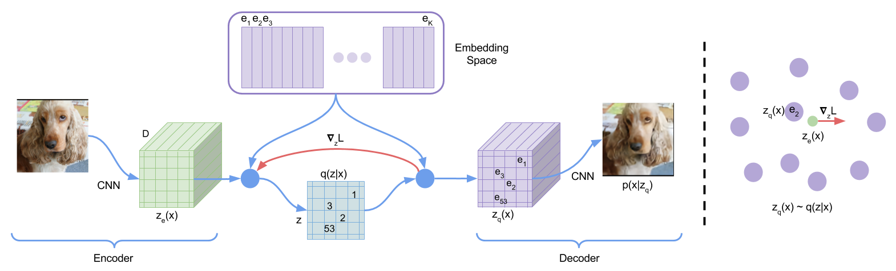

> 核心部件
- **编码器（CNN）**：将输入图像下采样为一个二维特征网格（如 32×32），其中每个位置对应一个 D 维连续特征向量，表示图像局部区域的语义信息。
- **码本（Codebook）**：维护一个固定大小的嵌入表（如包含 512 个向量，每个向量对应一个唯一编号）。编码器输出的每个连续向量都会被替换为码本中欧氏距离最近的向量——也就是**向量量化**，其编号（Code Index）即作为离散 token。最终，整张图像被表示为一个二维的 token 网格，实现了连续潜空间的离散化。
- **解码器（CNN）**：接收量化后的特征向量（由 Codebook 查表得到），逐步恢复空间分辨率，重建出原始图像。 
- **自回归先验模型（PixelCNN）**（生成阶段额外训练）：在离散 token 网格上学习各位置 token 的联合分布，生成新的 token 网格，再交由 Decoder 解码为图像。

|  涉及模型   | **是什么**  |      **输入 → 输出**      |
| :-----: | :------: | :-------------------: |
| **编码器** |   CNN    |   图像 → 连续特征 z_e(x)    |
| **解码器** |   CNN    |    量化特征 z_q → 重建图像    |
| **先验**  | PixelCNN | 前面的 token → 下一个 token |

【训练过程】
两个阶段的训练：1. "图像 ↔ token"的转换器； 2. 在 token 上训自回归先验。
1. **训练编码器、解码器和码本**：让图像经"编码 → 量化 → 解码"后尽可能还原自身，以重建损失为主目标，同时更新编码器、解码器和码本。
	- 难点：量化量化（"找最近的码本向量"）这一步不可导，梯度无法直接穿过
		- 直通估计（straight-through estimator）解决：前向传播照常做量化替换，反向传播时把解码器的梯度**直接"拷贝"** 回编码器，**绕过不可导的量化步骤**
		- 另用专门的损失项来更新码本向量和约束编码器输出
	- 训练完成: 得到一个能把图像编码为离散 token、并从这些 token 重建图像的编码-解码模型（后来的工作通常将其称为图像 Tokenizer）。
2. **训练自回归先验**： 冻结上一阶段的编码器与码本，**把训练集中的每张图编码为离散 token 网格（训练时可按固定顺序展开为序列）**，再训练 PixelCNN 学习这些 token 的联合分布，再在这些序列上训练一个 **PixelCNN**，学习「根据前面的 token 预测下一个 token」。此阶段与训练语言模型如出一辙，只是词表换成了视觉码本。

【生成过程】
生成沿"自回归生成 token 序列 → 解码还原图像"两步展开。
- **逐 token 自回归采样**： 用训练好的 PixelCNN 先验，从头逐个生成 token——根据已生成的 token 预测下一个 token 的分布并采样，直到凑齐一整张图所需的 token 网格（如 32×32）。**相比逐像素，token 数量少了一两个数量级**，生成步数大幅减少。
- **解码还原**： 将生成好的token 网格（按固定顺序逐个生成）按编号查回对应的码本向量，送入解码器，一步还原成完整图像。


【核心贡献】
VQ-VAE 首次提出可学习的离散潜空间（Discrete Latent），把连续图像表示压缩成离散 token，为自回归模型从「逐像素预测」转向「逐 token 预测」奠定了基础，成为连接 VAE 与自回归生成模型的重要桥梁。

【局限性】
- 单层量化，全局与局部难兼顾： 原始 VQ-VAE 只有单一尺度的码本，难以同时刻画图像的全局结构与精细细节，生成质量与同期 GAN 仍有差距（这一点由后续的 VQ-VAE-2 通过多尺度层级量化改进）。
- 码本相关问题： 训练中可能出现码本利用率低（大量码字几乎不被使用）等问题，影响表征效率。
- 两阶段训练：需要先训练 VQ-VAE，再训练 PixelCNN Prior，训练流程较复杂，也无法端到端联合优化。

【地位与影响】
后续几乎所有自回归图像生成工作的 **tokenizer** 都源自 VQ-VAE 的思想。没有它就没有后面的 VQGAN、DALL·E 1、LlamaGen。其"**离散视觉词典**"的理念，也是日后将图像纳入统一多模态序列、与文本 token 一同建模的关键前提。
## 3.VQ-VAE-2(2019)

>[!quote] _Generating Diverse High-Fidelity Images with VQ-VAE-2_ — Razavi et al. (DeepMind) (2019)https://arxiv.org/abs/1906.00446

>[!hint] **在 VQ-VAE 基础上引入分层设计，大幅提升生成质量。**


1. 原版VQ-VAE核心痛点
单层矢量量化只有一套离散token：
- 量化码本粒度粗：全局轮廓能稳住，但纹理、边缘等局部细节丢失；
- 量化码本粒度细：细节清晰，但token总量暴增，后续自回归建模计算成本爆炸、训练难度上升。
单层结构无法同时平衡**全局构图**与**局部精细纹理**。
2. VQ-VAE-2 核心改进：双尺度分层量化
搭建两层层级编码结构，分离全局、局部信息：
	1. **顶层粗尺度量化**：下采样程度高，token数量少，负责编码图像整体布局、大结构、色彩全局分布；
	2. **底层细尺度量化**：分辨率更高，token侧重像素级纹理、小边缘、精细细节。

两层独立量化，各司其职，不用单一码本强行兼顾两端。
3. 配套优化：分层自回归先验
两层量化特征各自训练专属自回归先验模型：
	- 顶层先验建模全局结构的分布规律；
	- 底层先验基于顶层全局信息，再预测局部细节token；
分层建模降低单一层的建模压力，生成时先画整体轮廓，再填充细节。
4. 最终效果
在不激增token总量、控制计算开销的前提下，解决单层VQ-VAE细节模糊、结构失真问题，图像生成保真度、清晰度显著提升。


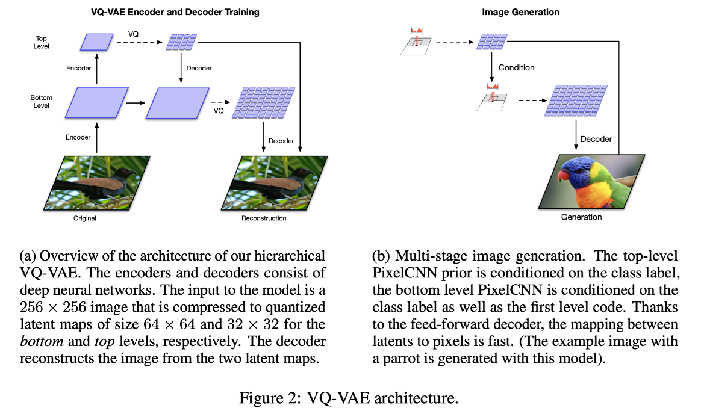

**【模型结构】**
从**单层量化**转化为**分层量化**，架构维持“编码→量化→解码”框架
- 编码
	- 顶层（全局）：粗颗粒、token少，负责把握物体大致信息
	- 底层（局部）：颗粒细、token多，负责编码精细信息。量化时以顶层信息为条件，使生成细节与全局结构保持一致
- 解码
	- 综合顶层与底层两套离散表示，共同建造高分辨率图像
- 每层配套独立自回归先验模型

>[!note] 什么是codebook
>**Codebook（码本）** 本质上是一个有限的、可学习的“数字标准特征字典”，它包含了一组固定长度的特征向量（称为码本向量）；它的作用是将编码器生成的连续、无限种可能的图像特征，通过“就近匹配”强行映射为字典里固定、离散的“特征暗号”（即索引 ID），从而在极大压缩数据的同时，将图像转化为类似文本 Token 的离散表示，以便后续的生成模型（如 PixelCNN）像玩文字接龙一样进行自回归预测与创造。

**【训练与生成过程】**
这里是为您翻译并整理好的 VQ-VAE-2 两阶段训练算法的中文 Markdown 版本，您可以直接复制到笔记中：

---

算法 1：VQ-VAE 训练（阶段 1）
**输入函数与数据：** * $E_{top}$（顶层编码器）
* $E_{bottom}$（底层编码器）
* $D$（解码器）
* $\mathbf{x}$（训练图像的 Batch 批次）
---
**训练步骤：**
1. **计算顶层连续表征：**
$$\mathbf{h}_{top} \leftarrow E_{top}(\mathbf{x})$$

2. **顶层离散量化：**
> ▷ *使用顶层码本（Codebook）进行矢量量化（对应公式 1）*
> $$\mathbf{e}_{top} \leftarrow Quantize(\mathbf{h}_{top})$$

3. **计算底层连续表征：**
> *（将原始图像与已量化的顶层特征一同输入底层编码器）*
> $$\mathbf{h}_{bottom} \leftarrow E_{bottom}(\mathbf{x}, \mathbf{e}_{top})$$
3. **底层离散量化：**
> ▷ *使用底层码本（Codebook）进行矢量量化（对应公式 1）*
> $$\mathbf{e}_{bottom} \leftarrow Quantize(\mathbf{h}_{bottom})$$
4. **图像重建：**
$$\mathbf{\hat{x}} \leftarrow D(\mathbf{e}_{top}, \mathbf{e}_{bottom})$$

5. **参数更新：**
> ▷ *根据公式 2 计算总损失（重建损失 + 承诺损失）并更新网络参数 $\theta$*
> $$\theta \leftarrow Update(\mathcal{L}(\mathbf{x}, \mathbf{\hat{x}}))$$

---

**算法 2：先验模型训练（阶段 2）**

**初始化：**

* $\mathbf{T}_{top}, \mathbf{T}_{bottom} \leftarrow \emptyset$ （初始化顶层和底层的潜码训练集为空）
---

**第一步：提取全量数据的离散潜码（Latent Codes）**
* **For** 每一张图像 $\mathbf{x} \in \text{训练集}$ **do**
1. $\mathbf{e}_{top} \leftarrow Quantize(E_{top}(\mathbf{x}))$
2. $\mathbf{e}_{bottom} \leftarrow Quantize(E_{bottom}(\mathbf{x}, \mathbf{e}_{top}))$
3. $\mathbf{T}_{top} \leftarrow \mathbf{T}_{top} \cup \mathbf{e}_{top}$
4. $\mathbf{T}_{bottom} \leftarrow \mathbf{T}_{bottom} \cup \mathbf{e}_{bottom}$
* **End For**

**第二步：训练自回归先验模型**
1. **训练顶层自回归模型**（例如带自注意力机制的 PixelCNN）：
$$p_{top} = TrainPixelCNN(\mathbf{T}_{top})$$
2. **训练底层条件自回归模型**（以顶层潜码为条件的 PixelCNN）：

$$p_{bottom} = TrainCondPixelCNN(\mathbf{T}_{bottom}, \mathbf{T}_{top})$$

**第三步：独立采样与生成生成流程（Sampling Procedure）**
* **While** 模型上线 / 持续生成 **do**
1. **从顶层先验中采样：** $\mathbf{e}_{top} \sim p_{top}$
2. **结合顶层潜码，从底层条件先验中采样：** $\mathbf{e}_{bottom} \sim p_{bottom}(\mathbf{e}_{top})$
3. **送入纯前向解码器生成新图像：** $\mathbf{x} \leftarrow D(\mathbf{e}_{top}, \mathbf{e}_{bottom})$
* **End While**

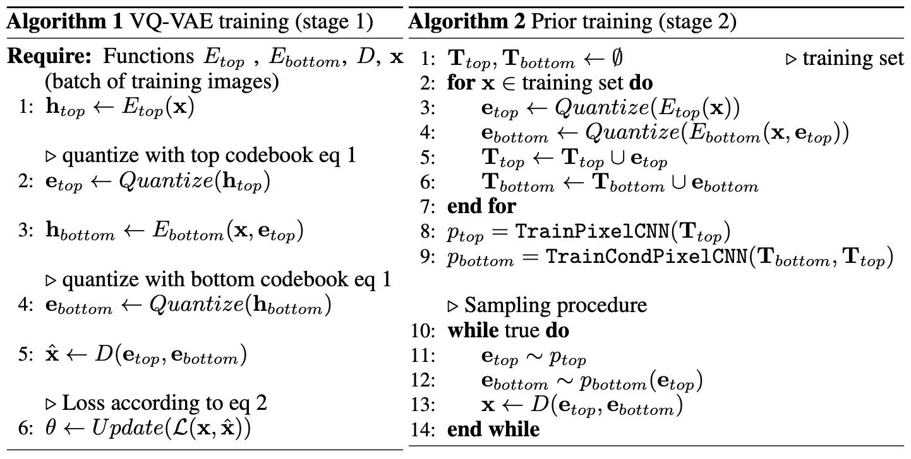

【**局限**】

- 仍依赖独立的先验模型： 生成质量受限于自回归先验（如 **PixelCNN**）的建模能力，且分层结构使训练与采样流程更复杂。
- 对抗/感知质量仍有差距： 重建主要由像素级重建损失驱动，在感知真实感上仍不及引入对抗训练的方案（这一点由后续的 VQGAN 改进）。

## 4. VQGAN (2021)

【之前的局限性】
up总结：由于VQ-VAE还是很模糊，所以想到了借助GAN的优势对编码器进行优化。

论文总结：
- Transformer 的平方复杂度瓶颈：注意力机制计算复杂度随序列长度呈平方级（$O(N^2)$）增长，高分辨率图像（如 $256 \times 256$ 或百万像素）带来的超长序列将导致计算量崩溃。
- 传统 VQ-VAE-2 的多层冗余： VQ-VAE-2 仅依赖像素级的 $L_2$ 重建损失。为了抓取微观纹理，它被迫使用复杂的“多层分层离散编码”（如同时保留 $64\times64$ 和 $32\times32$ 的潜变量），这造成第二阶段自回归建模时的潜编码序列长达 $5120$，PixelCNN 等传统网络根本无法有效建模全局语义。


>[!quote] _Taming Transformers for High-Resolution Image Synthesis_ — Esser et al. (2021)https://arxiv.org/abs/2012.09841

>[!hint] **在 VQ-VAE 的基础上引入 GAN 对抗训练和 Transformer 序列建模。**

【简介】
提出 **VQGAN**。一阶段不再单纯追求像素对齐，而是通过**判别器**和**感知损失**（Perceptual Loss）进行对抗训练，在极高压缩比（单层 $16\times16$）下依然保证画面局部的逼真度和真实纹理；<u>二阶段利用“被驯服”的 **Latent Transformer** 代替 PixelCNN 预测离散 Token。</u>

**对生成图像领域的意义：** 它成功将 **CNN 的归纳偏置**（擅长局部连接和空间平移不变性，负责高效压缩）与 **Transformer 的表达能力**（擅长全局长程交互，负责语义组合）完美结合，打通了“跨分辨率自回归生图”的道路。

**【模型结构】**

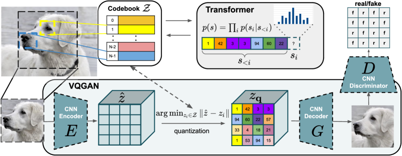

沿用VQVAE的"编码 → 量化 → 解码"框架，但训练目标和先验模型进行优化：
- 编码器 / 码本 / 解码器： 与 VQ-VAE 一致，负责把图像压缩为离散 token、再从 token 还原图像。
- 判别器（来自 GAN）： 额外引入一个 PatchGAN 判别器，对重建图像的局部块判断真假，专门用来提升还原图的感知真实感。**它只在训练 tokenizer 时使用，生成阶段不参与**。
- 自回归先验（Transformer）： 用 GPT-2 风格的 **Transformer** 替代 VQ-VAE 的 PixelCNN，在 token 序列上学习"下一个 token"的分布。相比 PixelCNN，Transformer 建模能力更强、扩展性（scaling）更好。

**【训练与生成流程】**
**第一阶段：训练 VQGAN 自编码器（离散化与对抗训练）**

目标：训练一个“高压缩比、高保真”的图像编解码器，让图像变成可以输入给 Transformer 的离散 Token。

```plain
# ========================================================
# 阶段一：VQGAN 的前向传播与损失计算（单步迭代伪代码）
# ========================================================

输入: 真实图像 X (尺寸: 256 x 256 x 3)
定义: 编码器 Encoder, 解码器 Decoder
定义: 离散码本 Codebook (包含 1024 个维度为 256 的向量)
定义: 图像块判别器 Discriminator

【前向传播流程】
1. 特征提取:
   连续特征图 z_e = Encoder(X)                 # 尺寸变为: 16 x 16 x 256

2. 向量量化 (Vector Quantization):
   对于 z_e 在空间上的每一个网格点 (i, j):
       a. 计算该点特征向量与 Codebook 中所有 1024 个码本向量的 L2 距离
       b. 找到距离最近的码本向量的索引 (Index)
       c. 记录该位置的离散 Token 索引: 索引值 s[i, j] = argmin(距离)
       d. 取出对应的码本向量，替换原连续特征，得到量化特征图: z_q[i, j] = Codebook[s[i, j]]

3. 直通梯度估计 (Straight-Through Estimator):
   # 由于 argmin 无法计算梯度，在此处强行将解码器的梯度直接复制给编码器
   z_q = z_e + (z_q - z_e).分离梯度()

4. 图像重建:
   重建图像 X_重建 = Decoder(z_q)             # 尺寸恢复为: 256 x 256 x 3


【损失函数计算与反向传播】
1. 计算自编码器总损失 (Loss_Generator):
   a. 重建损失 = 感知损失(X, X_重建)         # 引入 LPIPS，告别模糊，抓住微观纹理
   b. 码本损失 = L2_损失(分离梯度(z_e), z_q)   # 促使码本向量向特征靠拢
   c. 承诺损失 = L2_损失(z_e, 分离梯度(z_q))   # 约束编码器输出不要乱飘
   d. 对抗损失 = -ln(Discriminator(X_重建))   # 让生成的图像骗过判别器
   
   Loss_AE = 重建损失 + 码本损失 + 承诺损失 + 自适应权重 * 对抗损失
   反向传播并更新 [Encoder, Decoder, Codebook] 的参数

2. 计算判别器损失 (Loss_Discriminator):
   Loss_D = -ln(Discriminator(X)) - ln(1 - Discriminator(X_重建))
   反向传播并更新 [Discriminator] 的参数
```

>[!hint] 关键的三个损失
>1. 感知重建损失 (Perceptual Reconstruction Loss)：保证还原正确
>	1. **算式对应：** $\mathcal{L}_{\text{rec}} = \|x - \hat{x}\|_2$ （论文中将其替换/结合了基于 LPIPS 的感知损失）
>	2. 它是用来拉近“原始图像”和“解码重建图像”之间距离的
>	3. 普通的 $L_2$（像素级差值）损失，这会导致模型倾向于选择“最保险的模糊平均值”。
>	4. 感知级损失对比两张图在高级语义和局部纹理上的相似度
>2. 代码本与承诺损失 (Codebook & Commitment Loss)
>	1. $$\| \text{sg}[E(x)] - z_{\mathbf{q}} \|_2^2 + \| \text{sg}[z_{\mathbf{q}}] - E(x) \|_2^2$$
_其中 $\text{sg}$ 代表 `stop_gradient`（分离梯度/不回传梯度）。_
>	2. 这两者是专门用来训练离散码本（Codebook）的。
>3. 对抗损失 (Adversarial Loss)
>	1. **算式对应：** $\mathcal{L}_{\text{GAN}}(\{E, G, \mathcal{Z}\}, D) = [\log D(x) + \log(1 - D(\hat{x}))]$
>	2. **通俗解释：** 这就是引入了生成对抗网络（GAN）的机制
>	3. 有了对抗损失的兜底，编码器哪怕把图像压缩 20 倍，解码器也能在判别器的“逼迫”下，脑补出清晰、锐利、没有模糊感的局部边缘和高级视觉特征。


**第二阶段：训练 Latent Transformer（自回归语义建模）**
**固定住 VQGAN 的所有参数不再变动**。此时，每张图像都可以通过编码器完美转化为一个 $16 \times 16 = 256$ 长度的整数序列（Token 序列）

```plain
# ========================================================
# 阶段二：Transformer 的自回归训练与生成（伪代码）
# ========================================================

输入: 真实图像 X，或可选的控制条件 C (如：类别标签、分割图、文本描述)
定义: 已训练完毕并冻结的 VQGAN 模型
定义: 序列生成模型 Latent_Transformer (如 GPT-2 架构)

【训练阶段 (自回归因果建模)】
1. 提取视觉词汇:
   通过 VQGAN 编码器，将图像 X 转化为一维离散 Token 序列: S_图像 = [s_1, s_2, ..., s_256]

2. 提取条件词汇 (若有控制条件 C):
   If C 是空间布局(如分割图):
       S_条件 = 通过另一个VQGAN编码得到Token序列
   Else C 是非空间布局(如类别标签):
       S_条件 = 类别对应的 Embedding Token
   
   # 将条件 Token 拼接到图像 Token 前面，组合成一个大序列
   输入序列 = 连接([S_条件, S_图像]) 

3. 预测下一字 (Next-Token Prediction):
   对于序列中的每一个位置 t:
       Transformer 根据当前位置之前的所有 Token [s_<t]，预测下一个 Token 的概率分布 P(s_t)
   
4. 计算损失:
   Loss_Transformer = 交叉熵损失(P(s_t), 真实的 s_t)
   反向传播并更新 [Latent_Transformer] 的参数


【推理/生成阶段 (自回归图片采样)】
1. 初始化输入序列:
   当前序列 = [S_条件] (若无条件，则从起始符 [SOS] 开始)

2. 逐点循环生成 (生成 256 次):
   For 步数 t 从 1 到 256:
       a. 预测分布 = Latent_Transformer(当前序列)
       b. 提取最后一个位置的概率分布，使用 Top-k 或核采样(Nucleus Sampling)抽签决定下一个 Token
       c. 当前序列 = 连接([当前序列, 抽中Token])

3. 渲染出图:
   a. 截取生成的最后 256 个图像 Token，恢复成 16 x 16 的索引矩阵
   b. 根据索引矩阵，从 VQGAN 的 Codebook 中查找对应的特征向量，拼接成特征图 z_q
   c. 最终图像 = VQGAN_Decoder(z_q)
   输出最终图像
```

**【核心贡献】**
**VQGAN = VQ-VAE 的离散量化 + GAN 的对抗训练 + Transformer 的序列建模**。

【局限性】
- **自回归推断速度极慢：** 在第二阶段生成图像时，必须像 GPT 写文章一样，“一个点一个点（Token by Token）”循环迭代生成。由于无法并行，生成高分辨率图像的时间开销非常巨大。
- **累积误差与伪影：** 自回归模型固有的“一步错步步错”问题在图像上表现为局部伪影。一旦中间某个视觉 Token 预测歪了，后续滑动窗口内生成的图像纹理可能会出现不连贯、扭曲或统计特性漂移。
- **高低频权衡的临界点：** 编码器的下采样因子 $f$ 存在严格限制（如 faces 数据集在 $f=16$ 是极限）。若进一步压缩至 $f=32$ 或 $f=64$ 以缩短序列，一阶段的自编码器重建能力会发生断崖式下跌，产生不可逆的细节丢失。
## 5. DALL·E1(2021）
> [!quote] _Zero-Shot Text-to-Image Generation_ — Ramesh et al. (OpenAI) (2021)https://arxiv.org/abs/2102.12092

>[!hint] **第一个大规模的文生图自回归模型。**

**【简介】**
传统的文本到图像生成方法大多依赖于在固定、小规模的数据集上进行训练。为了提高图像质量，先前的研究通常需要采用非常复杂的模型架构（如多尺度 GAN）、引入各种辅助损失函数，或者在训练中提供繁琐的额外信息（如物体部件标注、语义分割掩码等）。这类方法的**泛化能力极差，极度依赖领域内的数据分布**，难以应对开放域（Open-domain）和极具创意的全新文本描述。
”首次大规模的文生图模型“，其关键的改进就是将文本与图像统一成一条token序列，用单一大型Transformer自回归预测序列。该模型包括：**dVAE**（离散VAE，将图像压缩成token），和一个120亿参数的自回归Transformer。
与VQ-VAE-2对比的关键变化：
- 第二阶段的先验从PixelCNN换成Transformer
- 文本作为条件拼接进序列

**【模型架构】**

- **dVAE(图像tokenizer）**：沿袭 VQ-VAE 的离散化思想，将图像编码为一串离散图像 token，并能从 token 还原回图像。它扮演的是"图像分词器"角色，把连续的图像翻译成 Transformer 能处理的离散符号。
- **自回归Transformer（120亿参数）**：处理的是**"文本 token + 图像 token"拼接而成**的统一序列，任务是标准的"下一个 token 预测"，与 GPT 类语言模型在机制上完全一致。

**【训练过程】**
- 第一阶段：使用离散变分自编码器（dVAE）将高维度的 $256 \times 256$ 像素图像压缩成 $32 \times 32$ 的离散图像 Token 网格。
- 第二阶段：将 BPE 编码的文本 Token 与压缩后的图像 Token 直接进行拼接（Concatenate），并送入一个拥有 **120 亿参数的自回归 Transformer** 模型中，采用类似语言模型自回归预测下一个 Token 的方式共同建模文本与图像的联合概率分布。

**【生成过程】**
沿"文本 token 引导 → 自回归补全图像 token → 解码还原"展开：
- **文本编码**： 将用户输入的 prompt 用文本分词器编码为文本 token，作为序列的开头（条件）。
- **自回归生成图像 token**： Transformer 以这些文本 token 为前缀，逐个预测后续的图像 token——每生成一个就并入序列、作为下文继续预测，直到凑齐一整张图所需的图像 token。
- **解码还原**： 把生成的图像 token 交给 dVAE 解码器，还原成最终图像。整个流程与语言模型续写文本同构，差别仅在于"被续写"的是图像 token。
> [!note] 隐藏步骤
> 在实际的**生成过程**中，由于自回归模型单次生成的随机性较大，直接生成一张图的盲盒属性很强。因此，OpenAI 在生成时还引入了一个关键的后处理步骤：
> 1. **批量生成**：对于用户输入的一个 Prompt，模型通常会一次性自回归生成多个候选样本（例如 512 张图）。
> 2. **CLIP 筛选（关键）**：使用预训练好的 [CLIP 模型](https://openai.com/research/clip) 计算这 512 张图像与原始文本 Prompt 的匹配度分数。
> 3. **输出最优**：最后只向用户返回得分最高（最符合描述）的那张或几张图片。

**【核心贡献】**
第一次向公众展示了**「用文字描述生成任意图像」**的能力，引爆了整个 text-to-image 赛道。
- **大一统的多模态建模范式（Autoregressive Unified Modeling）**：摒弃了复杂的辅助损失和定制 GAN 架构，将多模态生成任务无缝转化为一个标准的自回归序列预测问题。
- **双阶段图像 Token 化架构**：通过引入 Gumbel-Softmax 优化的 dVAE，将海量图像成功转化为离散的“视觉词汇”，巧妙地解决了 Transformer 无法直接计算高分辨率像素注意力（计算复杂度与显存开销过大）的瓶颈。
- **卓越的零样本组合与推理能力**：在完全未接触过测试数据集的情况下（Zero-shot），模型可将毫不相干的概念进行逻辑重组（如“牛油果形状的椅子”），甚至表现出基础的图像到图像翻译（Image-to-image translation）和三维透视理解。
- **大规模工程化训练方案**：开发了一整套混合精度（Per-resblock 梯度缩放）与分布式优化（PowerSGD 梯度压缩、参数分片）的工程方案，解决了超百亿参数模型在 16 位半精度下训练易崩溃的行业难题。

>[!note] 普通 Softmax 解决的是“平滑输出”**的问题，而 Gumbel-Softmax 解决的是**“随机采样且可导（重参数化）”的问题
> - Softmax $$p_i = \text{Softmax}(h_i) = \frac{\exp(h_i)}{\sum_{j} \exp(h_j)}$$
> - Gumbel-Softmax： $$y_i = \frac{\exp((h_i + g_i) / \tau)}{\sum_{j} \exp((h_j + g_j) / \tau)}$$
> Gumbel-Softmax 是一种**随机（Stochastic）**的、带有**温度控制**的连续近似采样方法。它基于 **Gumbel-Max Trick** 演变而来。
> - **如果使用普通 Softmax**：模型会输出“以 10% 的概率属于第 1 个词，70% 属于第 2 个，20% 属于第 3 个”。此时它传递的是一个**连续分布**，而不是一个**离散的、单一的 Token**。
> - **如果使用 `Argmax` 挑选概率最大的 Token**：这能得到离散 Token（比如直接选第 2 个词，变成 One-hot 编码 `[0, 1, 0, ...]`）。但是 **`Argmax` 函数的导数处处为 0**，反向传播的梯度无法跨越这个离散选择传回给 Encoder，导致模型无法训练。
> **Gumbel-Softmax 的妙处（重参数化 Trick）**：它将“从分布中随机采样一个 Token”**这件不可导的事，拆分成了：**“确定的输入 + Gumbel 随机噪声”。
> **通过温度 $\tau$ 控制逼真度**：
>- 当 $\tau \to \infty$ 时，输出趋近于均匀分布（完全随机、平滑）。
>- 当 $\tau \to 0$ 时，它的输出概率极度两极分化，无限逼近于真正的离散 One-hot 向量。
>在训练中，随着温度 $\tau$ 慢慢调低（退火），模型既完成了**可导的端到端梯度传播**，又让最终的输出表现得像**真正的离散 Token 采样**一样。


【局限性】
- **生成图像分辨率极低**：其原始输出分辨率仅为 $256 \times 256$ 像素，在精细纹理、细节呈现（如面部微表情、小物体细节等）上极易出现模糊和畸变。 
- **复杂空间和关系属性混淆**：当输入的 Prompt 描述包含多个物体或复杂的空间关系（例如“红色的杯子放在蓝色的盘子上面，盘子放在绿色的桌子上”）时，模型容易产生属性绑定混乱（Attribute Confusion），将颜色和物体错误匹配。
- **高昂的计算与采样成本**：为了得到高质量图像，它通常需要预先自回归采样上百个样本，再通过 CLIP 进行二次筛选重排，这种“以多取胜”的做法带来了巨大的推理开销，实用性受到限制。
- **自回归长序列累积误差**：作为串行自回归模型，生成后期的图像 Token 时，由于前面的微小预测偏差容易产生“幻觉（Hallucination）”或累积误差，导致图像局部结构失真。


## 6. VAR（2024）

> [!note] **V**isual **A** uto**r**__egressive Modeling: Scalable Image Generation via Next-Scale Prediction_ — Tian et al. (北大 & 字节) (2024)https://arxiv.org/abs/2404.02905

>[!hint] 重新定义自回归顺序，将【逐tokne预测】改为【逐尺度预测】；第一次全面超越DiT

> 中间停滞了2年是因为在LDM发布后，大家发现Diffusion的路线仍然有拓展空间，搁置了对自回归方式的探索。

【简介】
传统的图像自回归（AR）模型（如 VQGAN、DALL-E）在处理图像时，通常使用分词器将二维图像离散化为 Token 网格，然后将其强制展平为一维序列。这种方法采用光栅扫描（Raster-scan，从左到右、从上到下）的“下一个 Token 预测（Next-token prediction）”机制。它面临两个重大缺陷：
- **违背视觉直觉：** 破坏了图像原有的二维空间几何结构，而人类感知或创作图像往往是先整体（粗）后局部（精）的。
- **性能与效率低下：** 传统的 1D 自回归序列过长，导致推理速度极慢，且生成质量（FID/IS）**显著落后于扩散模型（如 DiT）**，其可扩展性（Scaling Laws）也未得到充分挖掘。
VAR 重新思考了图像的“排列顺序”，抛弃了传统的光栅扫描，引入了**由粗到精的“下一尺度预测（Next-scale prediction）”**（或称“下一分辨率预测”）。它利用多尺度 VQVAE 将图像编码为一系列不同分辨率的二维 Token Map（例如从 $1 \times 1, 2 \times 2, 4 \times 4$ 一步步扩展到 $16 \times 16$）。在生成时，类 GPT-2 的 Transformer 每次以之前所有低分辨率的 Map 为条件，**同时并行预测**下一整个高分辨率的 Token Map。

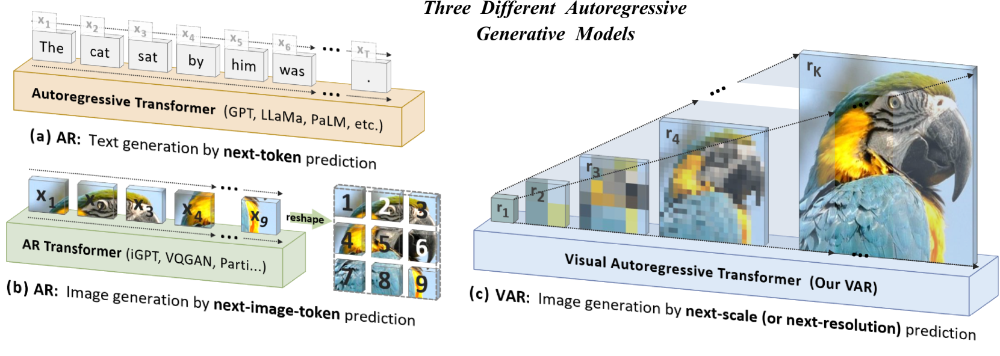


【模型结构】
VAR 仍是"tokenizer + 自回归 Transformer"的整体框架，但 tokenizer 和预测目标都围绕"多尺度"重新设计
- **多尺度 tokenizer**： 不再把图像编码为单一分辨率的 token map，而是编码为一组从粗到细、分辨率递增的 token maps（如 1×1、2×2、4×4 … 直到最高分辨率）。粗尺度承载全局结构，细尺度承载局部细节。
- **VAR Transformer 的训练**（按尺度展开）： 主体仍是 Transformer，但它自回归的单位是"一个完整的尺度"而非"一个 token"。预测某一尺度时，模型以此前所有更粗的尺度为条件，一次性并行生成当前尺度的全部 token。

【训练过程】
根据 [Visual Autoregressive Modeling (VAR)](https://arxiv.org/abs/2404.02905) 的设计原理，其训练和生成过程从传统的“逐个 Token 扫描”转变为“尺度（分辨率）间的自回归”。以下是简要描述：

---

**【1. 训练过程（Training Stage）】**

训练分为两个阶段，均采用自监督学习：

**阶段一：多尺度 VQ-VAE 的训练**
* **目的：** 让模型学会如何把一张图像完美地编码为多尺度的离散 Token 映射表（Token Maps）。
* **做法：** 训练一个定制的 VQ-VAE。对于输入的图像，编码器会提取其特征，然后通过不同的下采样/量化操作，同时生成一系列分辨率递增的二维 Token 阵列（例如 $1\times1, 2\times2, 4\times4, 8\times8, \dots, 16\times16$）。解码器则负责从这些多尺度 Token 中完美重构出原图。

**阶段二：VAR Transformer 的训练**
* **目的：** 让类 GPT 的 Transformer 学会“下一尺度预测（Next-scale prediction）”。
* **做法：**
1. 将第一阶段提取出的多尺度 Token 序列（从低分辨率到高分辨率）作为输入。
2. 采用教师强迫（Teacher-forcing）模式，模型在预测当前尺度（如 $4\times4$）的全部 Token 时，只能“看到”之前所有更低尺度（如 $1\times1$ 和 $2\times2$）的真值 Token。
3. **尺度内并行：** 在同一个尺度内部，所有 Token 的预测是同时进行的，通过交叉熵损失（Cross-Entropy Loss）来优化整个网络。

**【2. 生成/推理过程（Generation Stage）】**

生成过程是一个典型的自回归循环，但以“尺度”为单位进行：

* **步骤一（条件输入）：** 给定一个初始条件（如 ImageNet 的类别标签或起始 Token），作为 Transformer 的输入上下文。
* **步骤二（由粗到精的循环预测）：**
	1. **预测最低分辨率：** 模型首先根据条件，一次性并行输出最低分辨率（如 $1\times1$）的 Token Map。
	2. **逐步升级分辨率：** 将新生成的 $1\times1$ Map 拼接到上下文中，Transformer 根据它一次性并行预测下一尺度（如 $2\times2$）的整张 Token Map。
	3. **以此类推：** 拼接 $1\times1$ 和 $2\times2$ 的结果，预测 $4\times4$……直到生成最高分辨率（如 $16\times16$）的 Token Map。
* **步骤三（图像解码）：** 将最终生成的所有尺度 Token Map 输入给 VQ-VAE 的解码器，解码器将其“翻译”还原为高质量的连续 RGB 图像。

> **核心效率优势：** 传统 AR 产生 $16\times16=256$ 个 Token 需要串行数数 256 次；而 VAR 只需要按照尺度数量（假设有 5 个尺度）串行迭代 5 次，每个尺度内部完全并行，因此生成速度大幅提升。

**【核心贡献】**
传统自回归把 2D 图像强行拉成 1D 序列，丢失了空间结构信息。VAR 保留了 2D 空间关系，用多尺度层级替代了一维序列。首次在 ImageNet 基准上全面超越了 DiT，并验证了与 LLM 类似的 scaling laws。
- **刷新性能基准：** 在 ImageNet $256 \times 256$ 基准上，将传统 AR 的 FID 从 18.65 骤降至 **1.73**，IS 提升至 350.2，同时**推理速度提升了 20 倍**。
- **实证缩放规律（Scaling Laws）：** 首次在视觉自回归中验证了完美的幂律缩放行为，其模型扩大与损失下降的线性相关系数接近 $-0.998$，证明了其向超大模型演进的潜力
- **强大的零样本泛化：** 无需微调，即可直接应用于图像修复（In-painting）、图像外绘（Out-painting）和图像编辑（Editing）等下游任务。

**【局限性】**
- **对底层分词器的强依赖：** 模型的生成上限严重受限于多尺度 VQVAE 的重构质量。如果在极低分辨率（如 $1 \times 1$ 或 $2 \times 2$）编码时全局语义出现偏差，Transformer 很难在后续的高分辨率处理中修正这一根本性错误。   
- **长序列的计算和显存红利边际递减：** 尽管在单尺度内部实现了并行，但随着分辨率进一步扩大（例如走向 1024p 或高帧率视频），多尺度拼接后的上下文序列仍会变得极长，对自注意力机制的键值缓存（KV Cache）和显存占用提出了很大挑战。 
- **跨尺度的绝对因果假设：** 模型强制要求高分辨率尺度必须严格依赖所有的低分辨率尺度，这在某些局部细节（如复杂的纹理生成）上可能存在不必要的长程计算冗余。
**【影响力】**

作为 NeurIPS 2024 的重要成果，在计算机视觉和多模态大模型领域掀起了巨幅波澜：
- 打破了“扩散模型独大”的行业偏见： 过去几年中，以 DiT（Diffusion Transformer）、Stable Diffusion、Sora 为代表的扩散模型统治了图像与视频生成。**VAR 的出现向业界证明了：不需要复杂的扩散去噪加噪流，纯粹的 GPT 式自回归只要换一种“数数（排序）”的方式，就能在视觉生成上超越扩散模型**。
- 为“真正的大一统多模态模型”指明方向： 过去的多模态大模型（如 GPT-4o 级别架构）在文本上用自回归，在图像生成上却往往需要挂载一个外置的扩散解码器。**VAR 使得语言（Text）和视觉（Vision）可以使用完全相同的“下一个预测（Next-prediction）”**自回归哲学进行端到端训练，极大地推动了原生多模态大模型（Native Multimodal LLM）的演进。
- 引发了密集的社区追随与改进热潮： VAR 开源后在 GitHub 获得了数千 Stars，并迅速成为学术界研究的新热点。针对它的局限性，后续社区立刻涌现了大量衍生变体，例如引入马尔可夫假设以省去 KV Cache 提升效率的 MVAR (Markovian VAR)，以及高效分层掩码自回归 HMAR 等。它已成为多尺度视觉自回归技术生态里的奠基性工作。
- 

## 7. LlamaGen（2024）
>[!quote] _Autoregressive Model Beats Diffusion: Llama for Scalable Image Generation_ — Sun et al. (2024)https://arxiv.org/abs/2406.06525

>[!hint] **证明了即使不做任何和 VAR 类似的优化改造，直接暴力使用最标准的 LLM 架构也能超过扩散模型**

【简介】
LlamaGen 与 VAR 虽然都是 2024 年探讨自回归生成图像的杰作，但两者的哲学路线完全不同：VAR 改变了自回归的顺序（下一尺度预测），而 **LlamaGen 则坚持最原始的 GPT/Llama 式一维光栅扫描（Next-token prediction）**。

**提出时面临的问题**
- **扩散模型的绝对统治与技术割裂：** 在 2024 年之前，以 Stable Diffusion、DiT、Sora 为代表的扩散模型统治了视觉生成领域。然而，扩散模型的数学范式与大语言模型（LLM）的自回归范式完全不同，这为构建“文本-视觉”完全大一统的多模态原生大模型带来了巨大阻碍。
- **对纯自回归的偏见：** 业界普遍认为，如果在视觉信号上不加入任何特殊的空间归纳偏置（Inductive Bias），传统的 GPT 风格自回归模型（通过光栅扫描逐个预测 Token）在图像生成质量和可扩展性上无法企及扩散模型。

**改进方法**
LlamaGen 选择了“大道至简”的路线。它直接肯定并采用了大语言模型最原始的 **下一个词元预测（Next-token prediction）** 范式。
- 摒弃特殊的视觉结构设计，直接套用标准 **Llama 架构**（RMSNorm、SwiGLU、2D RoPE）。
- 重新审视并优化了离散图像分词器（Image Tokenizer）的设计空间。
- 引入了 LLM 社区极其成熟的并行训练与推理加速框架（如 FSDP、vLLM）。
>[!summary] 它沿用 DALL·E 1 式的"图像 token 化 + 标准下一个 token 预测"路线，模型从 1.11 亿个参数扩展到 **31 亿**个参数 参数，在 ImageNet 256×256 上达到 FID 2.18，超越了 LDM 和 DiT。其核心论点是：纯粹的 LLM 架构无需任何修改，即可胜任图像生成。


**【模型结构】**
LlamaGen 的核心设计理念是“减少针对视觉的特殊结构偏置，完全套用成熟的 LLM 架构”。它的结构主要由以下三个部分组成：
- **离散图像分词器（Image Tokenizer）：**
    - 采用经过深度优化设计的 **VQ-VAE / VQGAN** 架构。
    - 为了在大幅降低下采样率的同时保留极高的图像重建质量，它在 Codebook（码本）的向量上引入了 **$\ell_2$-正则化（L2-Normalization）**，并缩小了码本向量的维度（低维连续表征），同时扩大码本总容量 $K$。这使得图像被转化为离散的一维 Token 序列时，信息损耗降到最低。
- **主体 Transformer 骨干网络（Vanilla Llama Core）：** 
    - 完全剔除了诸如 AdaLN（自适应层归一化）等图像扩散模型中常用的“条件注入”模块。
    - 严格采用标准 Llama 的全套基础组件：**RMSNorm**（均方根预归一化）、**SwiGLU** 激活函数。      
- **位置编码（Positional Embedding）：** 
    - 不同于文本自回归的 1D 位置编码，LlamaGen 在每一层加入了 **2D 旋转位置编码（2D RoPE）**，以契合图像本身具备的二维空间几何特性。

**【训练过程】**
LlamaGen 的训练遵循清晰的“分阶段自监督”与“无监督条件注入”流程，分为两个独立阶段：
**阶段一：高保真分词器训练（Tokenizer Training）**
- **输入：** 原始高分辨率 RGB 图像。 
- **优化目标：** 联合训练 ConvNet 编码器、解码器以及离散码本 （Codebook），提升重建保真度。
- **损失函数组合：**
    - 像素级重建损失（Pixel-level $\ell_2$ Loss）。
    - 感知损失（Perceptual Loss，利用 LPIPS 评估）。
    - 对抗损失（Adversarial Loss，通过 PatchGAN 判别器进行博弈）。
    - 码本提交损失（Commitment Loss，让编码特征逼近码本向量）。
        
**阶段二：Llama 自回归模型训练（Autoregressive Training）**
- **数据准备：** 将训练集图像通过阶段一训练好的分词器，转换为一维离散 Token 序列（通过光栅扫描展平）。
- **条件编码：
    - _类条件（Class-cond）：_ 直接通过一个可学习的类嵌入查找表（Embedding Lookup）映射为 Token。
    - _文本条件（Text-cond）：_ 将提示词输入预训练好的文本编码器（如 **FLAN-T5 XL**），提取特征后再通过一个轻量级 MLP 映射为前缀 Token。
- **模型训练（Teacher-forcing）：**
    - 将条件 Token 作为“前缀（Prefilling）”，图像 Token 作为后续序列输入 Llama。 
    - 在标准的自回归掩码（Causal Mask）下，让模型根据已知的前缀和前面的图像 Token，串行预测“下一个 Token”。 
    - **无分类器指导（CFG）训练：** 在训练过程中，有一定概率（例如 10%）故意丢弃条件信号（如将文本或类别替换为 `null` 空白嵌入），以支持后续在推理阶段的质量放大   
    - **并行加速：** 针对大参数量版本（如 1.4B、3.1B），全面引入 LLM 社区成熟的 **PyTorch FSDP**（完全分片数据并行）进行显存优化。

**【生成/推理过程】**
生成图像是标准 LLM 从左到右、逐字吐出 Token 的视觉翻版：
- **步骤一：条件预填（Prefilling Stage）**
    - 用户输入特定的生成要求（如类别标签或一段描述画面的文字 Prompt）。
    - 模型将该条件编码为初始特征向量，作为整个自回归序列的开头（Prompt Tokens）。
- **步骤二：自回归序列生成（Next-token Iteration）**
    - Llama 骨干网络根据前缀条件，计算下一个图像位置 Token 的概率分布（Logits）。
    - **应用 CFG 调整：** 此时模型同时前向计算一次有条件和无条件的 Logits，并根据公式调整分布：
        $$\text{Logits}_{\text{final}} = \text{Logits}_{\text{uncond}} + s \times (\text{Logits}_{\text{cond}} - \text{Logits}_{\text{uncond}})$$
        
        _(其中 $s$ 为指导缩放因子，用于增强画面与提示词的契合度及清晰度)_。
    - **采样与迭代：** 从调整后的分布中采样出一个离散 Token，追加到序列末尾，然后送入下一步循环。
    - **光栅串行：** 重复此过程，严格按照“从左到右、从上到下”的顺序，直到吐满预设的图像序列长度（例如 $16 \times 16 = 256$ 次迭代）。
    - _基建提速：_ 推理时直接部署在 **vLLM 服务框架**上，利用 KV Cache（键值缓存）管理与 PagedAttention 技术，使这一串行生成速度骤增 3~4 倍。    
- **步骤三：图像反量化与解码（Decoding Stage）**
    - 将串行生成的 256 个一维 Token 重新排列回 $16 \times 16$ 的二维网格。
    - 通过 VQ 码本反查出对应的低维特征向量，最后输入给第一阶段训练好的 VQ-VAE 解码器，一口气恢复重构为连续的高保真 RGB 图像。

【核心贡献】
- **重证纯自回归的威力：** 证明了 vanilla（原生）自回归模型无需改变一维序列预测的本质，即可在 ImageNet 上实现 **2.18 FID** 的顶尖生成质量，超越了 DiT。
- **高画质图像分词器（Tokenizer）：** 提出了一个下采样率为 16 的离散分词器，在 ImageNet 上实现了 0.94 rFID 的极高重建质量和 97% 的码本（Codebook）利用率，证明离散表征不再是重构瓶颈。
- **完整的模型谱系：** 开源了从 1.11 亿（111M）到 31 亿（3.1B）参数量的一系列类条件（Class-conditional）与文本条件（Text-conditional）生成模型。
- **LLM 生态的完美迁移：** 首次成功将 LLM 推理服务器框架（vLLM）引入图像自回归模型，直接为图像生成带来了 **326% - 414% 的推理速度提升**。
# 五、大厂的选择

## 1. OpenAI

> [!hint] **反复横跳。**图像**从自回归转向扩散再转向自回归**；视频（Sora）纯扩散。：高筑语言自回归墙，视觉领域“脚踩两只船”
- **2021 - 2022年（分化探索）：** 早期的 OpenAI 既有基于自回归的图像模型 [Image GPT (iGPT)](https://arxiv.org/html/2406.06525v1#bib.bib69) 和 [DALL-E (v1)-2021](https://arxiv.org/html/2406.06525v1#bib.bib71)，也有探索扩散模型的 [GLIDE](https://arxiv.org/html/2406.06525v1#bib.bib72)。随后，OpenAI 在文本领域全面确立了自回归的至高地位（GPT-3/4），但在视觉生成上，他们转向了扩散模型，发布了里程碑式的 **DALL-E 2**。
- **2023 - 2024年（多模态融合与视频爆发）：**
    - **DALL-E 3** 依然采用扩散架构，但通过将自回归的 ChatGPT 作为“Prompt 放大器”，实现了惊人的文本理解能力。
    - **Sora（视频生成）** 则是集大成者。它采用了 **Diffusion Transformer (DiT)** 架构——本质上是用自回归中常用的 Transformer 作为骨干网络去预测扩散过程中的噪声。这标志着 OpenAI 走向了“结构用 AR 的（Transformer），生成用扩散的（Diffusion）”的融合路线。
- **2025 - 2026年（原生统一）：** 随着 GPT-4o 及其后续原生多模态大模型的发展，为了消除跨模态的割裂，OpenAI 在内部更加激进地推进**纯自回归的多模态全栈统一**，让文本、音频、视觉信号共享同一种自回归预测范式。
**技术演进脉络：**

- **DALL·E 1**(2021,[arXiv:2102.12092](https://arxiv.org/abs/2102.12092))——纯**自回归**。dVAE + 120 亿参数 Transformer,把图当 token 序列预测。
- **DALL·E 2**(2022,[arXiv:2204.06125](https://arxiv.org/abs/2204.06125))——掉头转**扩散**。unCLIP 架构(Prior + 扩散 Decoder)。当时扩散在质量上碾压自回归,OpenAI 务实地放弃了自家开创的 AR 路线。
- **DALL·E 3**(2023)——仍是**扩散**。核心创新不在架构而在数据:用约 95% 的合成详细字幕训练,大幅提升指令遵循。但它本质是独立模型,在 ChatGPT 里靠 pipeline 拼接(LLM 改写 prompt → 丢给 DALL·E 3 画),语言和画图是两套割裂系统。
- **GPT-4o 原生图像 / GPT Image**(2025 起)——又掉回**自回归**,且真正"原生嵌入"在全模态 LLM 里。OpenAI 在 [GPT-4o 系统卡补充文档](https://cdn.openai.com/11998be9-5319-4302-bfbf-1167e093f1fb/Native_Image_Generation_System_Card.pdf)中**明确**写了它是自回归、而非扩散。发布会白板那句"用一个大的自回归 Transformer 直接建模 p(text, pixels, sound)"就是纲领。[VTBench](https://arxiv.org/abs/2505.13439) 从行为侧佐证它是 AR:它会把图里读不清的文字"脑补"成通顺的词——这种"语言先验幻觉"正是图文 token 共享序列、被语言模型先验左右的典型表现。**业界普遍推测**它实际是 AR 骨干 + 扩散解码器的混合(先定粗结构、再逐行细化),但 OpenAI 未确认。
    
**模型演进脉络：**

- **GPT-4o 原生图像** —— 2025 年 3 月 —— 在 ChatGPT 上线内置生图,引爆全民生图,首周即有逾 1.3 亿用户生成超 7 亿张图。
- **`gpt-image-1`** —— 2025 年 4 月 —— 以 API 形式开放,自回归(确认)。
- **`gpt-image-1.5`** —— 2025 年 12 月 —— 在 ChatGPT 中称 ChatGPT Images,强化指令遵循与文字渲染。
- **`gpt-image-2`****(ChatGPT Images 2.0)** —— 2026 年 4 月 21 日 —— 引入 thinking(推理)模式、2K 分辨率、8 张批量、可先联网搜资料再作图,登顶 Image Arena(领先第二名一度 +242 分,创该榜最大领先纪录)。**注意:** OpenAI 研究者对 1.5 / 2 拒绝说明是扩散还是自回归,只称其为"通才模型 / GPT for images"——所以严格说,只有初代 GPT-4o 原生图像的 AR 范式是官方确认的,后续两代属未确认。([WaveSpeed 技术拆解](https://wavespeed.ai/blog/posts/gpt-image-2-2026/))


## 2. Google
> [!hint] **两边押注。**图像有**纯扩散（Imagen）**和**自回归（Nano Banana）**两条并行线；视频（Veo）是扩散。

**两条图像线:**
- **Imagen 3 / 4**:经典**纯扩散**,主打照片级真实感、人像、产品图。 
- **Nano Banana 系列**:**自回归主导**——用 Gemini LLM 当文本编码器,直接生成自回归图像 token(每张约 1290 个)喂给图像解码器,因此深度继承 LLM 的推理和世界知识(同样存在 AR+扩散混合的推测)。[Max Woolf 的拆解](https://minimaxir.com/2025/12/nano-banana-pro/)指出,其强项的秘密正是这个"既理解 prompt 又生成图像 token"的文本编码器。
    
**模型演进脉络:**

- **Gemini 2.5 Flash Image(初代 Nano Banana)** —— 2025 年 8 月 —— 以匿名代号"nano-banana"空降 LMArena,盲测击败 Midjourney、Flux,是 Arena 上投票量最大、最经受检验的型号之一。
- **Gemini Diffusion** —— 2025 年 5 月(I/O,候补名单制) —— **扩散式语言模型**,不逐词生成,而是像图像扩散那样从噪声迭代refine整块文本,约 1479 tokens/秒,擅长代码/数学/编辑。([DeepMind 官方页](https://deepmind.google/models/gemini-diffusion/))
- **Nano Banana Pro = Gemini 3 Pro Image** —— 2025 年 11 月发布、2026 年 5 月 28 日 API GA(6 月企业版 GA) —— 旗舰,主打 4K、复杂版面、世界知识、可靠多语种文字渲染,以 Gemini 3 Pro 为编码器、强制"thinking"。([Google 官方博客](https://blog.google/technology/ai/nano-banana-pro/))
- **Nano Banana 2 = Gemini 3.1 Flash Image** —— 2026 年 5 月 28 日 GA —— 高吞吐、实时场景的轻量高速版,GA 同日新增视频转图能力。([Google Cloud 公告](https://cloud.google.com/blog/products/ai-machine-learning/nano-banana-2-and-nano-banana-pro-are-generally-available))
- **DiffusionGemma** —— 2026 年(开源权重) —— 把 Gemini Diffusion 的研究做成开放权重版,建在 Gemma 家族上(MoE,约 26B 总参 / 3.8B 激活),H100 上 >1000 tok/s,用速度换质量,主打代码补全/内联编辑。
    

值得注意的是：Google 单独做了扩散语言模型(Gemini Diffusion / DiffusionGemma)，是三家里唯一在语言上押注扩散的。


## 3. zj
- **LlamaGen** —— 2024 年 6 月（开源） —— **纯自回归图像生成开拓者**，完全摒弃扩散架构，直接套用标准 1D Llama 结构和“下一个 Token 预测”范式。参数量从 111M 扩展至 3.1B，在 ImageNet 盲测上首次以纯自回归方式超越扩散模型（DiT），重证了 LLM 的 Scaling Laws 同样适用于视觉生成。([GitHub 开源页](https://github.com/FoundationVision/LlamaGen))
    
- **VAR (Visual Autoregressive)** —— 2024 年 4 月（开源） —— **多尺度“下一分辨率”自回归模型**。字节团队打破传统的 1D 光栅扫描，改为由粗到精的“下一尺度并行预测”。在生成速度上比传统 AR 提升 20 倍，FID 达到 1.73，引发了计算机视觉界对图像自回归算法的集体转向。([GitHub 开源页](https://github.com/FoundationVision/VAR))
    
- **Seaweed-7B (豆包视频大模型-海螺)** —— 2025 年 4 月发布（火山引擎） —— 字节跳动向影视级视频大模型下注的 **DiT 扩散架构模型**。主打复杂语义理解、多主体强动态交互与运镜控制，在剪映和即梦 AI 落地，与 OpenAI Sora 展开垂类长视频生成竞争。
    
- **Seaweed APT2 (海螺实时交互版)** —— 2025 年末发布 —— **实时交互式视频模型**。引入全新的自回归对抗后训练（AAPT）机制，用自回归机制去驱动视频扩散先验。支持单张 H100 实时生成 24fps 视频，并允许用户通过摇杆或动作捕捉实时交互控制视频中的运镜和虚拟人动作。
    
- **Seedance 2.0 (即梦/火山大模型)** —— 2026 年初合并升级 —— 字节将此前的 PixelDance（角色动画）与 Seaweed（环境动态）两大开发团队彻底打通后推出的旗舰级视频生成模型。上线后直接夺得大模型盲测平台 **Video Arena 排行榜第一名**，主打无缝的多镜头（Multi-shot）电影级流畅分镜与角色一致性。


# 六、思考

最后作者讨论了：如果模型的能力继续暴增，我们该如何做产品、做技术。

**第一点：技术可能会贬值。**
- 理由：以前做一个产品需要多人团队，但现在只需要少量技术和产品+AI。
- 结论：越来越多重复劳动被大模型替代，剩下的就是**系统设计**、**用户体验**、**数据**、**工作流搭建**

**第二：模型会越来越Agent化(偏向工程)**
以前：
```plain
User
↓

LLM

↓

Answer
```

最近以及未来：
```plain
User

↓

Planner

↓

Search

↓

Browser

↓

Python

↓

Image

↓

Verification

↓

Reflection

↓

Answer
```

**Agent 将成为默认的软件交互层**
固定、确定性的操作仍由传统界面完成；开放式、复杂、多步骤的任务则交给 Agent。用户不需要在两者之间切换，而是自然地在按钮、表单和自然语言之间流动


**第三：产品竞争力不再来自于模型**
用户更多注重于产品体验感，所以真正的竞争来自于$模型 × 产品设计$. 产品设计不容忽视。


**第四：通用最优非个人最优**
虽然通用大模型的综合表现能力已经足够绝大部分人的使用，但是落到个人的头上，大家还是希望模型能根据自己实际的个人偏好、公司环境来进行针对姓的回答。

**第五：不一定所有的场景都需要大模型**
最近：
```
传统按钮

↓

改成聊天框
```
反而导致体验感更差（比如日本的邮局银行新的APP……我的评价：过场多。甚至不是嵌入的LLM，只是做了个chatbot）

LLM更适合开放性问题，而一些固定操作，简单的操作用传统UI更快。

**第六：真正的机会可能在”工作流“的设计。**
在第四点中提到：”用户满意和模型能力之间还有距离。“，未来的开发重心会迁移到对Agent的每个阶段的设计：Agent如何规划、何时调用工具、何时停止、回滚、自检？


**第七：大家都能调用厉害的模型，竞争力则存在于模型之外。**
例如：个性化工作流、反馈类型；更适配的训练数据的针对性微调等

**第八：模型会逐渐趋同**
前期模型会逐鹿各大榜单，但后面各个模型的差距会越来越小，且集成在大家的电脑里面，使用的模型的性能差异不再是大家产出的决定性因素。

**第九：Evaluation 会成为新的核心能力**
能持续测量用户真实满意度，并快速优化工作流，谁就拥有更强的产品竞争力。

## 总结
我更倾向于把未来看成两个并行发展的方向：

- **模型层**：继续追求更强的智能、更低的成本、更高的可靠性，这是基础设施的竞争。
- **产品层**：围绕真实任务设计工作流、积累专有数据、建立用户反馈闭环，把通用智能转化为特定场景中的高价值体验。
对于开发者来说，最大的变化或许不是“会不会被 AI 替代”，而是**软件开发的边界正在扩大**。以前很多因为实现成本太高而无法尝试的产品设想，现在可以快速验证；产品经理、设计师、算法工程师和软件工程师之间的分工也会变得更加融合。未来优秀的开发者，不仅需要理解技术，还需要理解用户、业务和整个任务流程，因为这些越来越成为决定产品价值的关键因素。

---
其他笔记：
[[../../技术学习/13-深度学习入门-生成模型/07-变分自编码器|07-变分自编码器]]  
