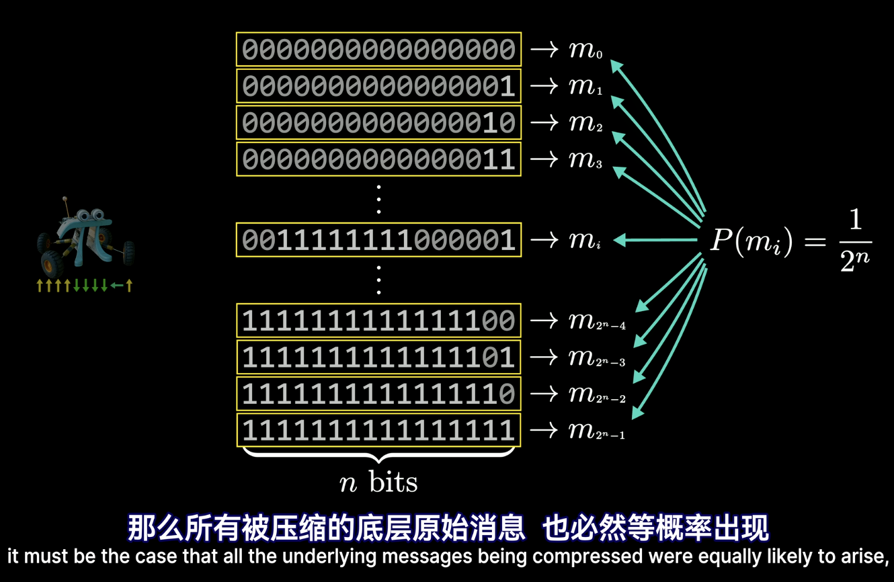
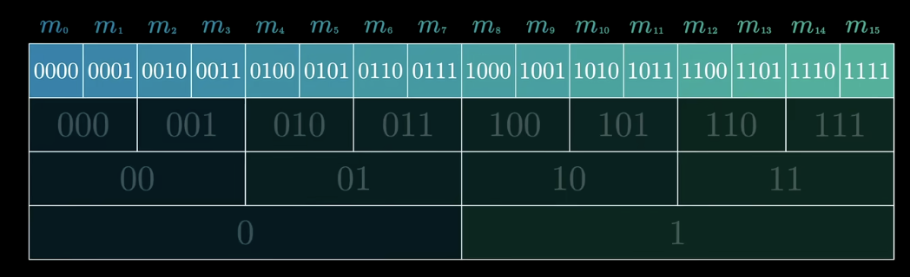
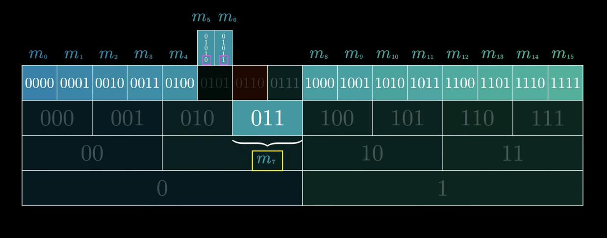
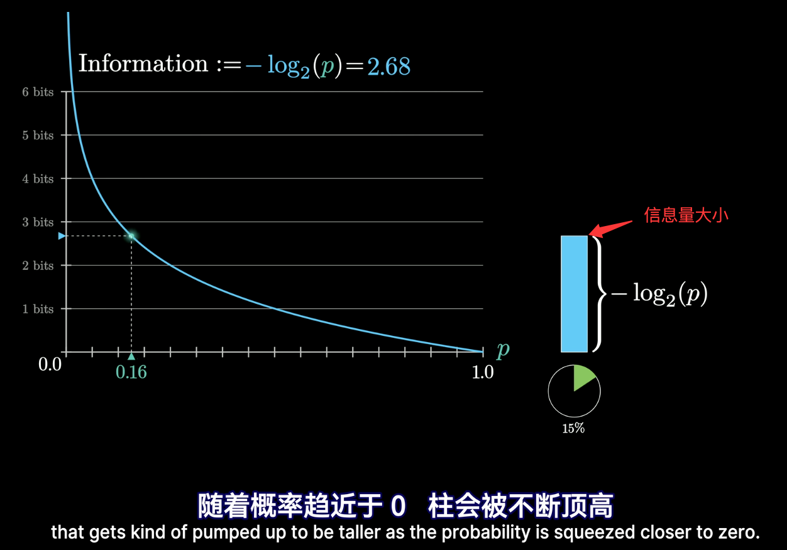
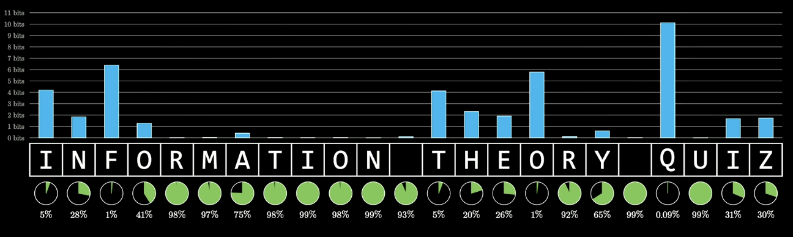
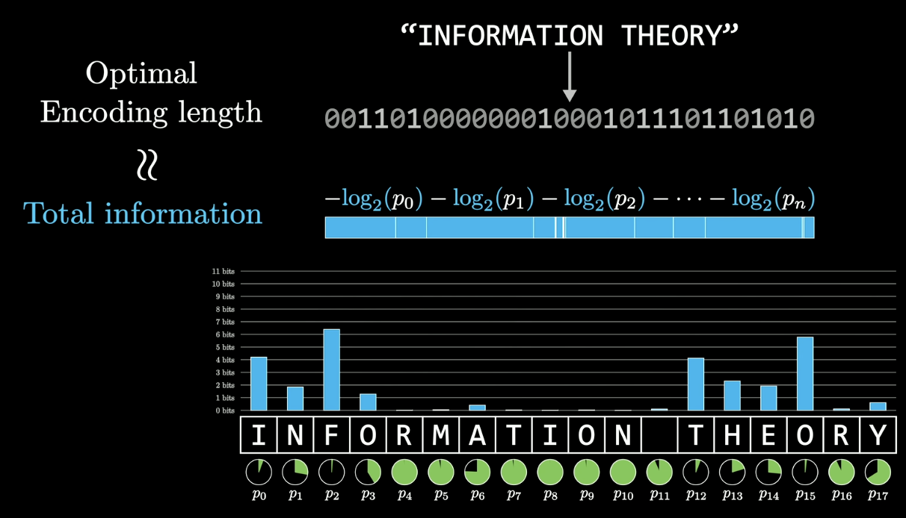

>[!abstract] 笔记来源
> [【【官方双语】压缩即智能：Part1，重新发明熵】 ](https://www.bilibili.com/video/BV1yVNU6xERx/?share_source=copy_web&vd_source=fe1e50f3e19ee2c5f4cd32de1f11a963)

# 背景介绍

思考一个问题，在使用二进制编码的时候，会希望用**尽量少的容量来存储数据**，这就是对数据压缩的需求。 进一步思考，**如果可以压缩，那这个极限又在哪里？又是什么决定了压缩的上限？**

对文字的编码，最常见的ASCII码的效率并不高，每个字符都需要8bit来存储，进而人们想到，可以将字符的使用频率进行区分和关联，减少常用字符的比特串长度，编码可以压缩到每个字符4bit左右。

若是一个文章，则可以利用长上下文关系，进行更复杂的关联和压缩。

>[!question] 压缩的极限在哪里？又该如何去计算？

这个问题就可以追溯到1940年代，克劳德·香农（Claude Shannon）所开创的《信息论》。

这个理论在现在的机器学习中也起到了非常多的贡献，如 #交叉熵 

>[!hint] 一个有趣的结论
>信息论的结论表示，**预测**和**压缩**在数学上是等价的。
>> 甚至有人断言：压缩即智能

关于上述提到的问题，其实目前尚未得到定论，但要讨论的话，或许还需要引用一些关于”智能“的概念。

> [!hint] 思考
> 最高效的”指令串到比特流“编码方式是什么？
> 已知:每个指令发生的概率相互独立，部分指令的概率远高于其他指令。

**方法一：直接对每个情况进行编码**
假设有4种指令，则用2bit（00，01，10，11）进行编码，但这样没有充分利用指令发生概率分布不均的信息。

**方法二：按照发生频率用不同长度的比特进行编码**
比如，若发生概率为$\frac{1}{2}$则编码为0或1，若发生概率为$\frac{1}{8}$则用（110或111）。但这会对接收方造成困扰，解码，也就是在什么地方划分编码成为困难，其中一种解决方案是让这些编码**互不为前缀**（**哈夫曼编码**）。确实在一定程度上可以减少所用比特大小，常见的指令占更小的比特，不常见的虽然占用更多比特位，但相对较小的出现频率又弥补了这一问题。

> 其实这里给到一个提示，表示信息的大小与其频率存在某种关系。

方法三：
> [!think] 一个完美的编码会有什么性质？
> 1. 噪音无法压缩的
> 2. 完美编码压缩后的信息应该和噪音接近，即无法进一步压缩

假设是纯噪声，那没个bit取0和1的概率相等（50%），使用哈夫曼编码，似乎就是能得到一串”噪声“，但又包含了准确的信息。

**为什么说随机噪声不可压缩？**
假设接收方收到固定长度为n bit的信息，这个是被“完美编码”压缩后的数据。如果压缩后的这个n比特流真的像随机噪声，那么每一位取0、1的概率相同，即，所有长度为n的比特串都等概率 = 所有被压缩的底层原始消息，也必然等概率出现： $$ P(m_i) = \frac{1}{2^n}$$

那为什么这个不可被压缩？以哈夫曼编码为例，编码后这$2^n$条等概率消息的编码（比特流）视为该图中某一层的比特串：

想尝试别的方法编码：
- 情况1： 更短的方法编码，则必须往下层移动。
	- 会与其他消息重叠，这个被重叠的消息必须移动到其他地方，迫使另一个消息和这个被重叠消息一起被推动到更高一层，各自多用1 bit来消除歧义。这会导致编码效率更低

所以，若是“完美压缩法”编码后的的数据，长度为n，则每个情况的概率必定是$\frac{1}{2^n}$:
$$

P(any \ n-bit \  message) = \frac{1}{2^n} \tag{1}

$$
等于
$$ p =  2^{-n} $$
两边取2为底的对数，再取反：
$$
- \log_2(p) = n \tag{2}
$$
等同于说：分配给一条消息的比特数n，假设是完美压缩，等于$-\log_2(p)$
其中$p$为该消息的出现概率。

公式（2）被香农定义为：一个事件的信息量。$Information = -log_2(p)$

>[!Tldr] 为什么有取对数的操作？
>1. 信息量必须满足**独立事件可相加**，这唯一导向对数函数；
>> 两个独立事件p和q，两个独立事件同时发生表示为pq，那两个事件一起发生得到的信息：$$I(pq)=I(p)+I(q)$$
>> 而满足这种函数关系的只有:$I(p)=k\log(p)$
>2. 二进制编码的状态数与位数满足 $2^n$ 的指数关系，因此用 $\log_2$ 正好把"状态数"转换成"位数"。
>> 因为这里的用bit作为单位，表示有多少种情况，若有N种情况，则每种情况的概率表示为：$p=\frac{1}{N}$ , 可以得到 $N = \frac{1}{p}$, 进而可以得到，需要表示N种情况的比特数n为：$$ 2^n = N $$
>> $$ n = \log_2N = \log_2 \frac{1}{p} = -\log_2 p $$
>

- 低概率消息包含大量信息
- 高概率消息包含少量信息

在完美压缩法中，分配给完整消息的比特数，精确等于这个信息量。

因为完美压缩暂时还没有算法能达到（压缩算法可能对某个特例过拟合），所以公式（2）是给信息的可压缩程度定了一个下界。

**但是在实际场景下，很难有如此完美的，每种情况的概率都是$\frac{1}{2^n}$。**

比如，自然语言生成任务，每个字母的出现概率高度依赖于前面的内容，而这个概率显然不可能都是很标注的呢2的整数次幂，计算得到的信息量就是一堆小数。

高度可预测的字母，信息量低；
高度不可预测字母，信息量高。

仔细看柱状图的左边，为什么这些信息量用比特为单位呢？

借助概率的链式法则与对数的链式法则对应。

>[!Tldr] 链式法则
> 1. 概率的链式法则
> 对于相对独立事件A、B，A和B同时发生的概率：$$P(A,B) = P(A)P(B|A)$$
> 进一步推导，A、B、C同时发生的概率：
> $$P(A,B,C) = P(A)P(B|A)P(C|A,B)$$
> 那么得到：
> $$P(x_1,\cdots,x_n) = \prod_{i=1}^{n} P(x_i|x_1,\cdots,x_{i-1})$$
> **联合概率 = 一连串条件概率的乘积。**
> 2. 将信息定义为 $I(x) = -\log_2P(x)$,联合事件的信息量即为：$I(A,B) = -\log_2P(A,B)$，带入上述链式法则，转换右边的部分，最终会得到$$I(A,B)=I(A)+I(B) \tag{3}$$ ⭐️
> > 概率的乘法变成了对数的加法。
> 
> 单个事件满足公式（3），取期望，得到香农熵著名链式法则：$$\boxed{ H(A,B) = H(A) + H(B|A) }$$

**将每个单词的字母信息量相加，从而决定最终所用编码的长度。**

