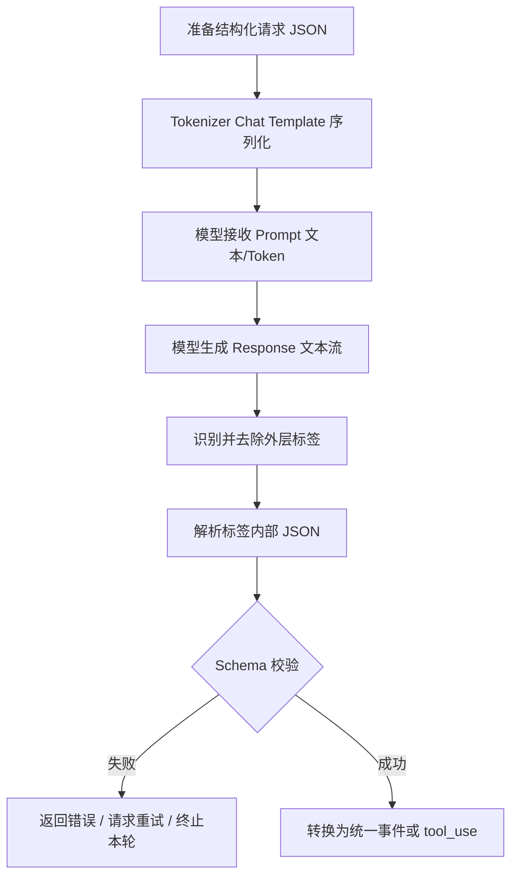
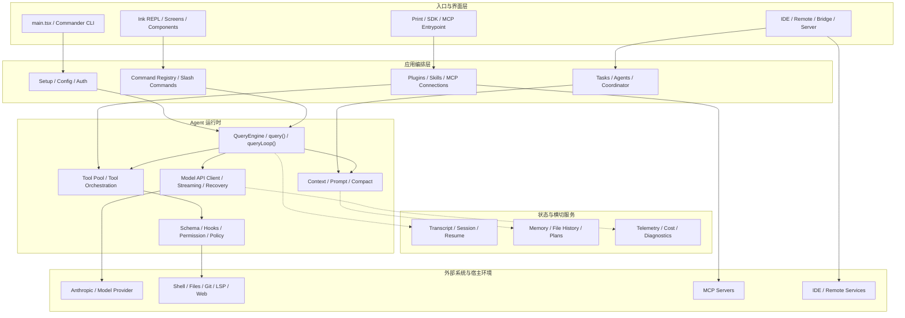
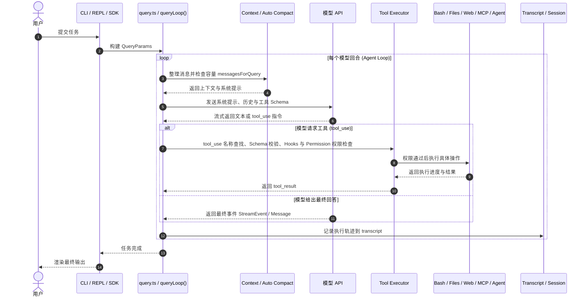
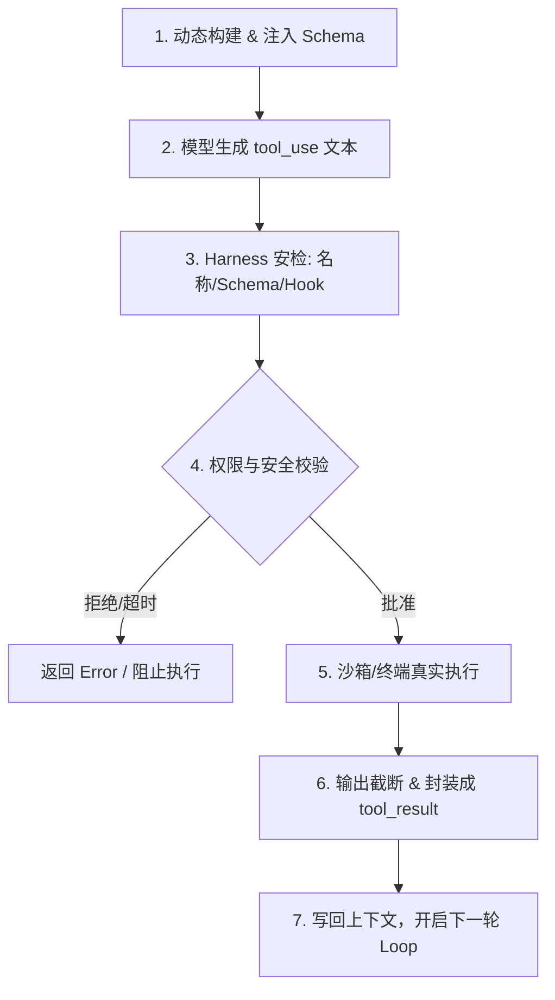
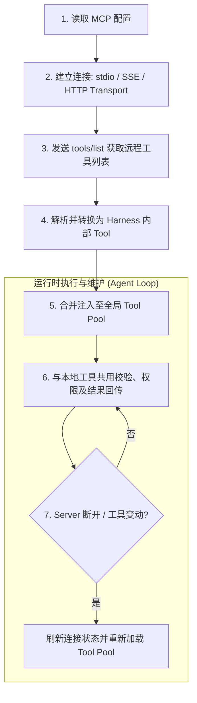

>[!quote] 笔记来源参考
> 2026 科协暑期基础技能培训 —— Harness，讲师：张维轩 讲义和学习资源同步在酒井暑培网站同步发布 课程主页：`https://summer26.net9.org/ai/harness/` 本次分享将带领大家阅读 Claude Code 源码，沿着真实 Harness 的运行链路，深入分析任务循环、规划机制、上下文管理、工具调用、记忆机制与子 Agent 协作等核心设计，理解这些能力如何在实际系统中实现。


> [!faq]- 1. 职责边界：在 Tool Use 的过程中，模型（LLM）与 Harness（宿主系统）各自扮演什么角色？为什么不能把模型生成的原始文本直接传给 Shell 执行？
> * **模型（LLM）的角色**：充当“决策大脑”。仅负责根据当前的 Prompt/Context 进行逻辑推理，并输出符合指定 JSON Schema 的意图文本（如工具名称及参数）。模型本身没有操作系统权限，也不能直接操作硬件。
> * **Harness 的角色**：充当“执行器官与安全中枢”。负责解析模型输出的字符串、校验参数合法性、拦截高危指令、触发用户授权确认、代为在宿主环境或沙箱中执行工具，并将执行结果（`tool_result`）写回上下文供模型下一次决策。
> * **不能直接传给 Shell 执行的原因**：
>   1. **安全性风险**：模型可能产生幻觉，输出包含高危或破坏性的命令（如 `rm -rf /`、非法文件overwrite），或者存在注入攻击风险，必须由 Harness 进行安全规则过滤与用户授权确认。
>   2. **语法/格式不匹配**：模型输出的可能是未严格对齐 Schema 的非法 JSON，甚至包含多余文本，直接传给 Shell 会抛出语法错误或导致不可预期的状态破坏。
>   3. **状态与环境隔离**：Harness 需要维护环境状态（如 `cwd` 当前工作目录、超时控制 `timeout`、结果长度截断等），直接调用 Shell 会导致环境状态失控。

> [!faq]- 2. 事件与架构解耦：为什么 queryLoop() 需要采用 Async Generator 并持续抛出 QueryEvent？这种设计解决了什么痛点？
> * **采用 Async Generator + QueryEvent 的原因**：
>   * `queryLoop()` 本质上是一个长时间运行的异步决策循环，单次 Agent 任务往往包含多轮模型思考与工具调用。
>   * 通过 `async function*`，Harness 可以在执行的各个关键生命周期节点（如模型开始 Token 流式输出、发起 `tool_use`、等待用户确认、工具执行完毕）以强类型 `QueryEvent` 的形式即时向外 `yield` 事件。
> * **解决的架构痛点**：
>   1. **解除阻塞（阻塞式 API 痛点）**：避免了传统的“发起请求 -> 漫长等待 -> 一次性返回结果”模式，实现了实时流式响应与长任务的非阻塞推进。
>   2. **UI 与 Runtime 彻底解耦**：底层的 Agent 执行逻辑（`QueryEngine`）不需要关心上层是用 CLI 终端（Ink REPL）、IDE 插件还是 Web 端呈现。上层 UI 只需要通过 `for await...of` 监听 `QueryEvent` 事件流，即可响应式更新渲染状态（如打字机效果、进度条、权限弹窗等）。

> [!faq]- 3. 安全与权限安检：一个 tool_use 指令从模型返回到真正落地执行，需要经过 Harness 的哪几重安全拦截与校验机制？
> 一个标准的 `tool_use` 在执行前必须依次通过以下 **4 重安全防护**：
> 1. **名称查找与动态匹配 (Tool Lookup)**：校验模型请求的工具名称是否在当前全局 Tool Pool 中注册并对当前 Agent 开放。
> 2. **参数 Schema 格式校验 (Schema Validation)**：基于 JSON Schema（通常设置 `strict: true`）严格校验模型传入的参数类型、必备字段是否合规，剔除非法字段。
> 3. **Hook 拦截与策略检查 (Hook & Policy Control)**：触发前置 Hook 脚本（如 `PreToolUse` Hook），检查是否违反系统 Policy 或触发拦截规则（例如禁止直接修改特定分支或关键配置文件）。
> 4. **用户权限确认 (Permission Authorization)**：对于具备系统副作用的高危动作（如修改文件、执行 Shell 命令、创建分支等），Harness 会弹窗或在终端提示用户授权（Allow / Deny），只有在用户批准后才允许代为执行。

> [!faq]- 4. 上下文管理（Compact）：当 Agent 在长任务中 Token 占用逼近上限时，Harness 的“多层 Compact 机制”是如何按粒度进行层层降级收缩的？
> [Claude Code](https://github.com/anthropics/claude-code) 采用了**分层收缩策略**，优先清理无害且最占空间的数据，只有当空间依然不足时才重建整个会话：
> 1. **Microcompact（工具结果微调）**：最轻量级。优先清理早期、最占空间的 `tool_result`（如大量的终端日志、文件读取输出），仅保留最近的工具执行结果和对话消息。如果服务端支持 Prompt Cache，还会通过 Cache Editing 直接抹除旧工具结果。
> 2. **History snip（局部历史截断）**：删除部分特定范围的旧消息片段，并在切片处记录切片边界标记（snip boundary），降低局部 Token 消耗。
> 3. **Context collapse（局部历史折叠）**：将较早的连续对话片段归档提炼为摘要存入 Collapse Store，在请求时仅向模型投射压缩后的视图。
> 4. **Session Memory compact（整段会话记忆重建）**：复用后台持续提取的轻量级 Session Memory（项目记忆/关键变量），与近期未总结的消息进行拼接重建。
> 5. **Traditional compact（全局摘要重建）**：最彻底的降级手段。调用模型将全部旧历史总结为一份全局 Summary，清空旧消息并重新注入【全局摘要 + 必留消息 + 当前任务目标】，实现会话全局重建。

> [!faq]- 5. 多 Agent 协作（Multi-Agent）：在子 Agent 的派生和任务管理中，TaskCreate、TaskUpdate 以及 Worktree / Fork 机制分别解决了什么问题？
> * **TaskCreate**：解决了**任务解耦与依赖初始化**的问题。用于在并发/多 Agent 场景下创建一个处于 `pending` 状态的独立任务单元，明确任务目标，但暂不分配执行者（owner）。
> * **TaskUpdate**：解决了**任务调度、依赖管理与状态同步**的问题。负责为任务分配具体的执行 Agent，更新运行状态，并通过设置 `blocks` 和 `blockedBy` 建立任务间的双向依赖图，保证有依赖关系的任务能够按顺序解锁执行。
> * **Worktree / Fork**：解决了**多 Agent 并行开发时的文件与 Git 状态冲突**问题。
>   * `Fork` 实现上下文及会话状态的派生隔离；
>   * `Worktree` 为子 Agent 在本地创建独立的 Git 临时工作副本，使子 Agent 在并行修改代码或运行测试时，不会污染主 Agent 当前的工作区代码和 Git index 状态。

> [!faq]- 6. 深度拓展思考：如何利用 Transcript、QueryParams 和状态快照实现无损恢复 (Session Resume)？如何解决工具状态冲突？
> * **如何实现 Session Resume（断点续传与恢复）**：
>   1. **持久化轨迹 (Transcript Persistence)**：Harness 在运行期间以追加写（Append-only）的方式将每一个 `QueryEvent`（包含 Prompt、模型输出、`tool_use` 指令以及 `tool_result`）实时写入本地的 `Transcript` 文件。
>   2. **快照重构 (Snapshot Reconstitution)**：重新启动会话时，读取最新的 `QueryParams`（加载环境配置与规则），并解析 Transcript 文件，将历史消息重新按顺序拼装回 `Context Builder`，恢复崩溃前的模型上下文与 Task 依赖图。
>   3. **状态游标（Cursor Point）**：定位最后一次成功的 `tool_result`，从断点处的下一个模型回合或未完成的任务节点继续发起 `queryLoop()`。
>
> * **如何防止工具状态冲突或重复执行**：
>   1. **工具幂等性与状态校验 (Idempotency Check)**：恢复执行前，Harness 需对未闭环的工具进行状态比对。例如对文件修改动作（Edit/Patch），校验目标文件当前的 hash 或内容是否已经包含了变更，若已应用则直接跳过或回写成功状态。
>   2. **Git 工作区检测 (Git Status Check)**：利用 Git 的 `status` / `diff` 检查文件系统的实际状态。对于使用了 `Worktree` 的子 Agent，可以通过检测 `.claude/worktrees/` 目录的存在情况与 Commit 记录，判断子任务执行到了哪一步。
>   3. **未完成动作标记与回滚 (Transaction / Rollback)**：对于非幂等工具（如运行了部分 Shell 脚本），在恢复后不盲目自动重试该 Bash 命令，而是将“中断时的最后状态及异常”作为系统提醒（`System Message`）写回上下文，交由模型重新判断是需要撤销回滚还是继续补救执行。


| 分类                   | 核心机制                              | 相同点 / 异同点                                                  | 优点                                       | 缺点                                       | 发展路线                                                          |
| :------------------- | :-------------------------------- | :--------------------------------------------------------- | :--------------------------------------- | :--------------------------------------- | :------------------------------------------------------------ |
| **简易问答式**            | 单次请求，模型直接返回最终结果，无环境反馈             | **相同点**：均需模型进行意图理解与文本生成。<br>**异同点**：无工具调用、无多轮环境反馈，执行链路最短   | • 实现最简单<br>• 响应延迟最低<br>• 算力开销小           | • 无法获取实时/外部信息<br>• 无法执行复杂任务<br>• 容易产生幻觉  | 从早期的提示词工程与单轮 QA，演进为当下大模型的基础 API 交互方式                          |
| **Workflow**         | 预定义步骤、分支与依赖（如 DAG 或固定流水线）         | **相同点**：依赖 Harness 的控制流管理。<br>**异同点**：路径确定且结构化，缺少模型的动态自主决策 | • 流程确定性强、可预测<br>• 执行稳定且易于审计<br>• 适合标准业务流 | • 灵活性差<br>• 难以应对未预期的复杂变更或边缘场景            | 从传统规则/代码引擎，演变为融合 LLM 节点的低代码/可视化编排平台（如 n8n、Dify）               |
| **ReAct Agent Loop** | 模型在“思考-行动-观察”循环中，根据环境反馈动态选择动作     | **相同点**：支持工具调用与环境交互。<br>**异同点**：以单个 Agent 为核心进行自主多轮决策与工具调用 | • 自主适应性强<br>• 能处理未知或复杂任务<br>• 可灵活扩展工具库   | • 容易陷入死循环<br>• 消耗大量 Token<br>• 执行时延较高    | 从单工具调用扩展为具备持久记忆、沙箱隔离及严格权限控制的终端/IDE Agent（如 Claude Code、Cline） |
| **Multi-Agent**      | 多个 Agent 按角色分工，通过消息传递、共享状态或任务委派协作 | **相同点**：均包含多轮 ReAct 机制与工具交互。<br>**异同点**：由单点决策升级为多角色协作与任务拆分 | • 适合复杂工程拆分<br>• 模块化分工明确<br>• 能提升复杂任务上限   | • 协调开销极大<br>• 上下文占用高<br>• 容易出现一致性风险与状态冲突 | 从简单的多角色 Prompt 扮演，发展为复杂的分布协作、多 Agent 编程与软件工程自治系统（如 DeepCode）  |
# 一、预备知识
## 1.1 理解调用一次API的时候，网络请求流程



发送的请求会被整理成json的格式，若是本地模型，的 Chat Template 会把这些消息序列化成模型训练时使用的格式，示意如下（实际标记由模型决定）

```
<|system|> You are a coding assistant. Available tools: - read_file(path: string): Read a UTF-8 text file. When you need a tool, output exactly: <tool_call>{"name":"tool_name","arguments":{...}}</tool_call> <|end|> <|user|>Read README.md<|end|> <|assistant|>
```

Harness 先识别并去掉外层标签，再解析标签内部的 JSON，最后做 Schema 校验.

> **Schema 校验**就像是数据入库或被执行前的“安检”：它根据预先定义好的规则（如数据类型、必填字段、取值范围等），检查模型输出或传输的数据是否“格式合格”。如果校验失败，系统就会拒绝执行并返回错误，从而防止不合规的非法数据进入系统导致程序崩塌或产生安全风险。

发送请求的API格式，现在主流的是三种，且这三种之间互不兼容，使用中转站可以解决这个问题。

```# Response
curl --request POST \
    --url "${BASE_URL}/responses" \
    --header "authorization: Bearer ${API_KEY}" \
    --header "content-type: application/json" \
    --data "{
        \"model\": \"${MODEL}\",
        \"input\": \"Hello World\",
        \"stream\": false
    }"

# Chat Completions
curl --request POST \
     --url "${BASE_URL}/chat/completions" \
     --header "authorization: Bearer ${API_KEY}" \
     --header "content-type: application/json" \
     --data "{
        \"model\": \"${MODEL}\",
        \"messages\": [
            {
            \"role\": \"user\",
            \"content\": \"Hello World\"
            }
        ]
    }"

# Anthropic
curl --request POST \
    --url "${ANTHROPIC_BASE_URL}/messages" \
    --header "authorization: Bearer ${API_KEY}" \
    --header "x-api-key: ${API_KEY}" \
    --header "anthropic-version: 2023-06-01" \
    --header "content-type: application/json" \
    --data '{
        "model": "'"${MODEL}"'",
        "max_tokens": 1024,
        "messages": [
            {
                "role": "user",
                "content": "Hello World"
            }
        ]
    }'
```

| API 格式 | 核心特点与请求结构 | 适用范围 / 典型场景举例 |
| :--- | :--- | :--- |
| **Responses API** | • 传入单一的 `input` 字符串<br>• 结构相对简洁直接，适合非多轮对话场景 | • **标准单轮交互**：单次文本生成、快速摘要提取、简单翻译或分类任务。<br>• **轻量级后端集成**：不需要维护复杂上下文历史的边缘设备或无状态服务。 |
| **Chat Completions API** | • 使用包含 `role` 和 `content` 的 `messages` 数组<br>• 兼容标准 OpenAI 格式，生态支持最广 | • **多轮对话与 Agent**：OpenAI (GPT-4o)、Qwen (通义千问)、DeepSeek、Llama-Index/LangChain 默认适配方案。<br>• **通用企业级应用**：绝大多数主流大模型 API 中转服务及开源推理框架（如 vLLM, Ollama）。 |
| **Anthropic Messages API** | • 必须显式指定 `max_tokens`<br>• 使用专属请求头（如 `x-api-key`、`anthropic-version`） | • **深度代码与复杂推理**：Claude 3.5/3.7 Sonnet、Claude Code 等原生 AI 编程终端及 IDE 插件（如 Cline）。<br>• **长上下文与结构化工具调用**：对系统提示词（System Prompt）和工具调用有严格规范的 Agent 项目。 |

**拓展：跨 API 互不兼容的解决方案**

在实际开发与 Harness 构筑中，针对不同供应商 API 格式不兼容的问题，通常有以下两种主流解决方案：

- **应用层抽象 / SDK 适配器（Adapter Pattern）**
    - **统一数据结构**：在 Harness 代码内部定义一套统一的内部数据模型（例如统一定义 `Message`、`ToolCall` 和 `ResponseStream`）。
    - **协议转换器**：针对不同的 API 格式（OpenAI / Anthropic / Local LLM），编写对应的请求序列化与响应解析 Adapter，将统一数据转换为具体 API 所需的 JSON Payload。
        
- **使用统一网关 / 代理中间件（Unified Proxy / Gateway）**
    - **LiteLLM / One-API / New-API**：通过部署中间层网关，把 Anthropic Messages 或 Responses API 的请求自动转换为标准的 OpenAI Chat Completions 协议格式。
    - **统一调用入口**：前端与 Agent 核心逻辑只需对接统一的 OpenAI 规范接口，由网关在后台完成路由、格式转换、Token 统计与错误重试。

---

# 二、Claude Code源码架构图（泄露版）

## 2.1 架构总图



这个架构是典型的 **分层解耦 Agent 系统架构**（以 Claude Code 为例），从上到下划分为 5 个核心层次，各司其职：

**1. 入口与界面层 (Interface & Entrypoint)**
• **作用**：系统的最外层，负责接入不同的用户交互环境（CLI 终端、IDE 插件、SDK 或远程 Bridge）。
• **机制**：通过 `main.tsx` 或命令行解析器捕获用户指令，将其转换为标准化事件输入系统。

**2. 应用编排层 (Application Orchestration)**
• **作用**：负责系统的“基础设施”准备与业务逻辑调度。
• **机制**：处理身份认证、配置读取（`Setup`）；注册斜杠命令与插件/MCP 链接（`Plugins`）；管理多 Agent 协作与任务分发（`Tasks`）。

**3. Agent 运行时 (Agent Runtime - 核心大脑)**
• **作用**：驱使 Agent 进行“思考-决策-执行”的主循环（ReAct Loop）。
• **机制**：
  - `QueryEngine` 控制主循环流程；
  - `Context` 维护 Prompt 组装与长上下文压缩；
  - `Tool Pool` 管理可用工具，并配合 `Schema` 与 `Permission` 进行严格的权限校验；
  - `API Client` 负责流式通信与失败恢复。

**4. 状态与横切服务 (State & Cross-Cutting Services)**
• **作用**：贯穿全生命周期的“记忆”与“监控”保障。
• **机制**：管理会话记录（`Transcript`）、项目持久化记忆/文件修改历史（`Memory`），以及 Token 消耗和诊断日志（`Telemetry`）。

**5. 外部系统与宿主环境 (External Environment)**
• **作用**：Agent 实际作用的外部真实世界。
• **机制**：通过 API 请求模型（`Anthropic`），在宿主环境（Shell、Git、文件系统）中执行指令，或通过 MCP 服务扩展外部能力。

## 2.2 链路图
时序图强调消息的先后关系：模型只提出工具调用请求，真正的权限校验和执行由 Harness 完成。




## 2.3 程序进入Agent loop前

展示Claude CLI从进程进入到Agent Loop的准备过程。
- `run()`： 组装运行环境
- `query()`：负责一次任务
- `queryLoop()`：负责任务内部持续决策和执行
重点理解这些函数的指责边界：
- `main() / run()`：准备 Agent 能使用的环境
- `query()`：启动一次任务，并向 UI 输出事件
- `queryLoop()`：维护任务内部的循环状态

```cmd
Claude CLI 进程启动
│
├─ 1. main()
│   ├─ 记录启动性能检查点
│   ├─ 设置进程级安全环境
│   ├─ 注册 warning / exit / SIGINT 处理器
│   ├─ 解析命令行参数
│   └─ 调用 run()
│
├─ 2. run()
│   │
│   ├─ 2.1 读取运行配置
│   │   ├─ 用户配置
│   │   ├─ 项目配置
│   │   ├─ 环境变量
│   │   └─ CLI 参数覆盖
│   │
│   ├─ 2.2 建立身份与会话
│   │   ├─ 认证信息
│   │   ├─ API Client
│   │   ├─ model 配置
│   │   └─ session id / transcript
│   │
│   ├─ 2.3 加载项目上下文
│   │   ├─ cwd
│   │   ├─ CLAUDE.md
│   │   ├─ 项目设置
│   │   ├─ Git / 工作区信息
│   │   └─ additional directories
│   │
│   ├─ 2.4 建立权限上下文
│   │   ├─ allow / deny rules
│   │   ├─ 用户确认回调
│   │   ├─ sandbox 配置
│   │   └─ ToolUseContext
│   │
│   ├─ 2.5 注册和发现 Skill
│   │   ├─ initBundledSkills()
│   │   ├─ getSkillDirCommands()
│   │   ├─ 读取 SKILL.md
│   │   └─ 转换为 Command / Skill 定义
│   │
│   ├─ 2.6 连接 MCP
│   │   ├─ connectToServer()
│   │   ├─ 选择 stdio / SSE / HTTP Transport
│   │   ├─ tools/list
│   │   ├─ fetchToolsForClient()
│   │   └─ MCP Tool 转换为内部 Tool
│   │
│   ├─ 2.7 组装 Tool Pool
│   │   ├─ getAllBaseTools()
│   │   ├─ 按运行模式过滤
│   │   ├─ 按 Agent 类型过滤
│   │   ├─ 应用 deny rules
│   │   ├─ 合并 MCP Tools
│   │   └─ 排序、去重
│   │
│   └─ 2.8 选择交互外壳
│       ├─ REPL 交互模式
│       ├─ print mode
│       ├─ slash command
│       └─ SDK / 受控入口
│
├─ 3. 用户提交任务
│   │
│   ├─ REPL 接收用户输入
│   ├─ 创建 user message
│   ├─ 合并已有 conversation messages
│   ├─ 收集 tools / model / permission context
│   └─ 构造 QueryParams
│
├─ 4. query(QueryParams)
│   │
│   ├─ 创建命令生命周期记录
│   ├─ 调用 queryLoop()
│   ├─ 将内部事件作为 AsyncGenerator 向外 yield
│   └─ 正常结束后标记命令 completed
│
└─ 5. queryLoop()
    └─ 进入 Agent Loop；内部状态和执行转移见第 4 节
```

下面四个模块是构成Agent和用户互动的**控制中枢**和**事件总线**的核心：
* **REPL (Read-Eval-Print Loop)**
    *   **核心机制**：作为最外层的长期运行主循环，持续监听并读取用户在终端输入的文本或斜杠命令（Slash Command）。对于本地命令（如 `/help`、`/compact`）直接本地处理，对于普通任务则组装为请求启动 Agent。
    *   **工作目的**：为用户提供交互式入口，负责输入分流、界面渲染与会话生命周期管理，是驱动整个 Agent 持续运作的操作台。

*   **QueryParams**
    *   **核心机制**：在创建一次新 Query 时被静态组装的数据对象，打包了当前任务所需的全部上下文信息（包含用户输入、当前会话 ID、历史对话、可用的工具列表 Tool Pool、权限配置与沙箱规则等）。
    *   **工作目的**：作为一次单次 Agent 任务的静态配置快照与输入边界，为底层的 Agent Loop 运行提供所需的基础数据支持。

*   **QueryEvent**
    *   **核心机制**：Agent 执行过程中发出的标准化强类型事件流（例如模型开始生成文本、发起工具调用 `tool_use`、工具执行返回结果 `tool_result`、用户权限确认以及任务完成等状态）。
    *   **工作目的**：解耦 Agent 内部复杂的执行状态与外部 UI/系统的展示逻辑，实现流式输出、响应式 UI 更新以及可观测的状态记录。

*   **Async Generator (异步生成器)**
    *   **核心机制**：采用 `async function*` 语法，使 `query()` 和 `queryLoop()` 函数能够以异步迭代器（`for await...of`）的方式，在单次任务推进过程中向外持续 `yield` 抛出 `QueryEvent`。
    *   **工作目的**：提供一种非阻塞的流式通信管道，将 Agent 内部多轮思考与工具执行的动态过程，无缝实时地拉取并传递给 REPL 或上层界面展示。

## 2.4 Query Loop/ Agent Loop

Query Loop 是 Harness 的核心状态机。每一轮都会先整理上下文，再调用模型；如果模型请求工具，就执行工具并把结果加入下一轮，否则结束当前任务。

```
5. queryLoop()
    │
    ├─ 5.1 创建动态 State
    │   ├─ messages
    │   ├─ toolUseContext
    │   ├─ turnCount
    │   ├─ Compact 状态
    │   └─ Token 恢复计数
    │
    ├─ 5.2 检查上下文容量
    │   ├─ 估算当前 token
    │   ├─ 判断是否需要 auto compact
    │   ├─ compactConversation()
    │   └─ buildPostCompactMessages()
    │
    ├─ 5.3 准备模型请求
    │   ├─ system prompt
    │   ├─ CLAUDE.md / 项目上下文
    │   ├─ conversation messages
    │   ├─ Skill / Hook 注入内容
    │   ├─ Tool Schema
    │   └─ normalizeMessagesForAPI()
    │
    ├─ 5.4 调用模型并消费流式响应
    │   ├─ text delta
    │   ├─ thinking / signature 等协议块
    │   ├─ tool_use block
    │   ├─ usage / stop_reason
    │   └─ 生成 assistant message
    │
    ├─ 5.5 判断是否需要执行工具
    │   │
    │   ├─ 没有 tool_use
    │   │   ├─ 保存最终 assistant message
    │   │   ├─ 更新 session / telemetry
    │   │   └─ 结束 queryLoop
    │   │
    │   └─ 存在 tool_use
    │       ├─ 根据 name 查找 Tool
    │       ├─ 校验 input schema
    │       ├─ checkPermissions()
    │       ├─ allow / deny / 用户确认
    │       ├─ 执行 Tool.call()
    │       └─ 收集 progress 和最终结果
    │
    ├─ 5.6 将工具结果转成消息
    │   ├─ 收集 stdout / stderr / exit code
    │   ├─ 截断或持久化超大结果
    │   ├─ 创建 tool_result block
    │   ├─ 设置 tool_use_id
    │   └─ 包装成下一轮 user message
    │
    ├─ 5.7 更新状态
    │   ├─ 追加 assistant tool_use message
    │   ├─ 追加 user tool_result message
    │   ├─ 写入 transcript
    │   ├─ 更新 telemetry
    │   └─ turnCount + 1
    │
    └─ 5.8 返回循环顶部
        └─ 模型根据 tool_result 决定下一步
```

>[!hint] **一轮 Loop 的本质**：`Context 组装` ➔ `模型决策` ➔ `工具校验与执行` ➔ `结果写回上下文`。任何一环失败均由 Harness 捕捉恢复，而非直接崩溃。

## 2.5 Tool Use

Tool 层把模型可见的能力描述、Harness 内部的安全策略和真正的执行函数封装在同一个接口中。模型只接触名称、提示和 Schema，而 Harness 还会使用权限、并发和结果映射等字段。

在 Harness 中，**Tool Use（工具调用）** 是将 LLM 的文本生成能力转化为真实系统（Shell、文件系统、网络）控制权限的关键纽带。学习此模块需重点掌握以下核心维度：

*   **1. 模型视角 vs Harness 视角的非对称性（核心概念）**
    *   **模型视角**：仅感知纯文本的 `Name`、`Description` 和 JSON `Schema`；模型不具备直接操作系统的能力，仅负责输出符合规范的意图字符串。
    *   **Harness 视角**：封装底层的真实执行函数（`Handler`）、安全策略（`Policy`）、用户权限确认（`Permission`）、并发限制及结果映射；代为执行并进行闭环管控。

*   **2. Tool 的完整生命周期（执行链路）**



- **3. Harness 层的安全与工程防护**
    - **输入强约束**：配置 `strict: true` 强制 Schema 严格匹配，杜绝模型输出非法字段。
    - **状态与并发**：通过 `getAppState` / `setAppState` 进行状态统一调度，并基于 `isConcurrencySafe` 实现只读/写命令的并发控制。
    - **危险动作拦截**：自动识别高危指令（如 `rm -rf`、跨目录修改），强制触发用户二次确认或路由重定向。
    - **Token 保护**：设定 `maxResultSizeChars` 限制超大日志或文件读取输出，防止挤爆上下文 Token 预算。
- **4. 扩展机制与 MCP 协议标准**
    - **能力标准化**：理解内置 Tool（如 [BashTool](https://summer26.net9.org/ai/harness/harness%E8%AE%B2%E4%B9%89/#64)）与第三方外部服务（[MCP](https://summer26.net9.org/ai/harness/harness%E8%AE%B2%E4%B9%89/#65) - Model Context Protocol）的映射关系。
    - **无缝对接**：Harness 通过 `tools/list` 协议自动获取外部 MCP Server 的工具定义，并透明转换为本地统一接口供 Agent 调用。

> 这里的Tool还是内部，下面MCP的Tool是针对外部工具接入的方式。

## 2.6 MCP
MCP（Model Context Protocol）为 Harness 提供统一的外部工具接入方式。Harness 作为客户端连接 MCP Server，将远程工具的名称、描述和输入 Schema 转换为内部 `Tool`，因此 Agent Loop 无须关心工具来自本地还是远端。



连接建立后，MCP 工具与内置工具共用参数校验、权限控制和结果回传流程。Server 断开或工具列表变化时，Harness 还需要刷新连接状态和 Tool Pool。

 >核心机制精简要点：
> - **解耦设计**：Harness 作为客户端连接 MCP Server，将远程工具的名称、描述与 Schema 透明转换为内部接口。
> - **无感调用**：对于 Agent Loop 而言，完全屏蔽了本地工具与远端工具的差异，统一进行权限拦截和参数校验。

## 2.7 权限控制


权限系统位于模型决策与真实执行之间。即使模型请求了某项操作，也必须依次通过参数校验、规则匹配、必要的用户确认和运行时沙箱限制。

```
tool_use(name, input)
  -> Tool Registry 查找
  -> input Schema 校验
  -> isReadOnly / isDestructive 分类
  -> allow / deny / ask policy
  -> 用户确认（如果需要）
  -> sandbox / cwd / network 限制
  -> 执行或生成 is_error tool_result
```

`allow` 表示规则明确允许执行，`deny` 表示明确拒绝，`ask` 表示需要用户确认。拒绝本身通常不会终止 Agent Loop，而是作为错误形式的 `tool_result` 返回模型，让模型调整方案。

## 2.8 Context构建

 *   **1. System Prompt（系统提示与运行环境）**
    *   **运行标识**：全局配置参数（如 `cc_version`、`cc_entrypoint`、`cc_is_subagent`）。
    *   **环境上下文**：当前工作目录（cwd）、Git 仓库状态、操作系统及 Shell 版本、选用模型信息。
    *   **全局规则与记忆**：项目级指令文件（如 `CLAUDE.md`）及内存/历史偏好。

*   **2. User Messages（用户消息与任务输入）**
    *   **本轮输入与时间**：当前的绝对时间戳以及用户提交的 Prompt 或指令。
    *   **显式上下文**：用户手动附加的文件内容，以及工具执行后返回的结果（`tool_result`）。

*   **3. System Messages（系统消息与动态提醒）**
    *   **可用扩展能力**：动态注入的子 Agent 定义（`subagent_type`）与 Skill 定义。
    *   **Hook & 策略注入**：上下文压缩（Compact）提示、记忆回调或安全 Policy 拦截提醒。

*   **4. Tool Definitions（工具集注入）**
    *   **Schema 集合**：已注册工具（如 `Bash`、`Edit`、`Agent` 及 MCP 扩展工具）的名称、功能描述和 JSON Input Schema。

此外，在真实的工程落地中，上下文并非简单地无限追加，Harness 会实施严格的控制策略：

- **动态裁剪（Output Truncation）**：对 Bash 或文件读取等超大工具输出进行字符数截断（如限制 `maxResultSizeChars`），防止单次工具调用挤爆上下文。
- **多层 Compact（压缩）机制**：当历史对话逼近 Token 预算上限时，自动触发总结与压缩，仅保留核心状态与当前任务的关键上下文。
- **按需延迟加载（Lazy Context Injection）**：如 MCP 工具或子 Agent 的详细 Prompt，仅在相关触发条件满足时才动态注入上下文，以节省计算开销。

## 2.9 Multi-Agent & 任务协作机制

> 也是通过Tool进行实现。

Multi-Agent 中要区分两个概念：**Agent 是执行者，Task 是协调记录**。父 Agent 负责拆分目标，子 Agent 在受控上下文中执行，Task 工具记录负责人、状态和依赖。

```
父 Query
  -> Agent tool_use
  -> AgentTool 解析 prompt / subagent_type / model / 运行模式
  -> 构造子 Agent 的 Query 和工具上下文
  -> 子 Agent 执行搜索、读取、编辑或测试
  -> 返回摘要、状态或错误
  -> 父 Query 收到 tool_result，继续决策
```

子 Agent 通常拥有独立的消息历史、`agentId`、工具池、权限和取消控制器，但可以继承父任务所需的上下文、MCP 连接或工作目录信息。源码重点位于 `src/tools/AgentTool/`、`src/tasks/LocalAgentTask/` 和 `src/tasks/RemoteAgentTask/`。

**常见执行模式**

| 模式 | 说明 | 父 Agent 得到的特征/结果 |
| :--- | :--- | :--- |
| **前台 / 同步** | 当前进程等待子 Query 完成，适合短分析任务 | `completed` 或错误结果 |
| **本地后台** | 注册 `LocalAgentTask`，子 Agent 独立运行，适合长任务和并行探索 | `async_launched`，完成后通知 |
| **Fork / Worktree** | Fork 派生上下文；Worktree 创建隔离 Git 工作副本，二者可以组合 | 子任务结果、任务状态或变更路径 |
| **Remote** | 创建远程会话并由 `RemoteAgentTask` 轮询，适合远程或长期任务 | `remote_launched`、`session URL` |


`TaskCreate`、`TaskUpdate`、`TaskList` 和 `TaskGet` 管理的是工作项，不会自动启动 Agent：

| 步骤 / 工具 | 核心职责 | 说明 |
| :--- | :--- | :--- |
| **TaskCreate** | 创建 pending 任务 | 初始拉起任务，此时暂时没有指派 owner。 |
| **TaskUpdate** | 依赖与分配管理 | 分配 owner，更新任务执行状态，并设置 `blocks` / `blockedBy` 双向依赖。 |
| **TaskList / TaskGet** | 状态与进度检索 | 查看当前所有可执行任务清单或查询单项任务的具体详细状态。 |
| **Agent / teammate** | 领取并执行任务 | 实际分配给 Agent/teammate 领取任务，并真正启动运行子 Query。 |
| **TaskUpdate(completed)** | 结果回写与解锁 | 将任务状态标记为已完成，并自动解除后续依赖该任务的其他 Blocked 任务。 |

通常使用 `pending -> in_progress -> completed` 的状态流转；`deleted` 表示永久移除任务。`addBlockedBy: ["1"]` 表示当前任务必须等待任务 1，系统也会把反向关系写入任务 1 的 `blocks`。TeamCreate 会建立团队上下文和对应的 TaskList，但仍需通过 TaskCreate 创建工作项、TaskUpdate 分配负责人。

因此，Multi-Agent 的核心不是简单地“多开几个模型”，而是同时管理父子委托、上下文与权限隔离、任务依赖、取消传播和结果汇总。只读分析可以并行；共享文件编辑应串行，或使用独立 Worktree。


## 2.10 多层 Compact 机制

Claude Code 并不只有一种 Compact。源码把上下文收缩做成多个层次：先处理最占空间、最容易安全丢弃的工具结果，再尝试局部历史压缩；只有仍然接近窗口上限时，才重建整段会话。讲解时还要把“怎样压缩”和“何时触发”分开：`/compact`、auto compact 和 reactive compact 是触发路径，不完全是三种彼此独立的摘要算法。

Claude Code 的上下文收缩（Compact）分为不同的处理粒度和触发方式。源码采用了分层策略：优先清理最占空间且容易安全丢弃的工具结果，再进行局部历史压缩；只有在仍然接近上限时，才重建整段会话。

*   **10.1 按处理粒度分类（处理哪些数据）**
    *   **Microcompact（工具结果微调）**：清除较早、可压缩的 `tool_result`，保留最近的执行结果和对话消息。
        *   *Time-based*：若距离上次模型回复间隔过长（服务端 Prompt Cache 已冷），直接清空较早的工具结果。
        *   *Cached*：在服务端支持 Cache Editing 时，按 `tool_use_id` 提交修改，直接从缓存中删除旧工具结果，避免重写整个缓存前缀。
    *   **History snip（局部历史截断）**：删除指定的旧消息片段并记录切片边界（snip boundary），可与 Microcompact 同时触发。
    *   **Context collapse（局部历史折叠）**：将较早的会话片段分段归档为摘要并存入 Collapse Store，请求时再投影出压缩视图。
    *   **Session Memory compact（整段会话记忆重建）**：优先复用后台持续提取的 Session Memory，再拼接尚未总结的近期消息进行重建。
    *   **Traditional compact（整段会话全量摘要）**：调用模型总结旧历史生成全局摘要，保留必要消息并重新注入上下文以重建会话。

*   **10.2 按触发方式分类（何时触发）**
    *   **被动/手动触发 (`/compact`)**：用户在 REPL 中显式执行斜杠命令，主动清理和压缩上下文。
    *   **主动/自动触发 (`auto compact`)**：Harness 在每轮 Agent Loop 评估 Token 占用，当接近上下文窗口阈值时自动拦截并执行压缩（启用 Context collapse 时此触发可能会被抑制）。
    *   **响应式触发 (`reactive compact`)**：模型 API 返回 Prompt 过长或 Context Exceeded 错误时，被动捕获异常并触发降级收缩。

# 总结：Agent Harness 架构与开发入门指南

本讲义基于 Claude Code 源码架构拆解，旨在帮助开发者快速理解现代 Coding Agent（如 Claude Code、Cursor、Cline 等）底层的 **Harness（宿主与控制系统）** 设计原理，掌握“如何控制大模型与真实系统安全交互”的核心工程范式。

---

*   **学习目标**
    *   **理解底层本质**：分清“模型能力”与“Harness 职责”的界限，明白 LLM 如何在 Harness 驱动下从“文本生成”转化为“系统控制”。
    *   **掌握核心架构**：熟悉分层解耦架构（Interface ➔ Orchestration ➔ Runtime ➔ State ➔ Environment）及核心组件（REPL、QueryParams、QueryEvent、Async Generator）的运作机制。
    *   **搞懂闭环链路**：掌握 ReAct Loop（思考-行动-观察）的完整生命周期，包括 Prompt 组装、工具安全执行、权限拦截与动态上下文管理。
    *   **具备落地意识**：理解 Tool Use、MCP 扩展协议、多 Agent 协作（Multi-Agent）以及 Token 保护（多层 Compact 机制）的工程实现思想。

*   **核心学习要点**
    *   **非对称架构思想**：模型仅感知纯文本与 JSON Schema，Harness 则承担权限校验、安全沙箱、状态读写与结果映射的重任。
    *   **流式响应与解耦**：利用 Async Generator 与强类型 `QueryEvent` 实现响应式 UI 渲染与复杂 Runtime 执行逻辑的解耦。
    *   **安全安检机制**：所有 `tool_use` 必须经过“名称查找 ➔ Schema 校验 ➔ Hook 拦截 ➔ 用户 Permission 确认”四重防护，防止越权与高危指令。
    *   **上下文长效维护**：通过动态截断（Truncation）、微调压缩（Microcompact）与全局摘要（Traditional Compact）等多层收缩策略，保障长会话在有限 Token 窗口内的稳定运行。

*   **核心执行流程总结**
    *   **1. 意图捕获与环境初始化**：REPL 监听用户输入，静态打包配置、权限、工具池与历史会话为 `QueryParams`。
    *   **2. 上下文组装与模型请求**：Context Builder 动态融合 System Prompt、全局规则（如 `CLAUDE.md`）、历史消息与 Tool Schema 发起流式请求。
    *   **3. 动作决策与安全路由**：解析模型返回的 Token 流；若为最终回答则渲染退出，若为 `tool_use` 则进入安全安检逻辑。
    *   **4. 沙箱执行与结果闭环**：权限通过后代为在终端/沙箱中执行工具，截断超长输出并封包为 `tool_result` 写回上下文，开启下一轮 Loop。

---

**大模型决定“下一步做什么”，而 Harness 决定“这一步能否执行、如何执行、如何记录以及如何把结果安全呈递”。**